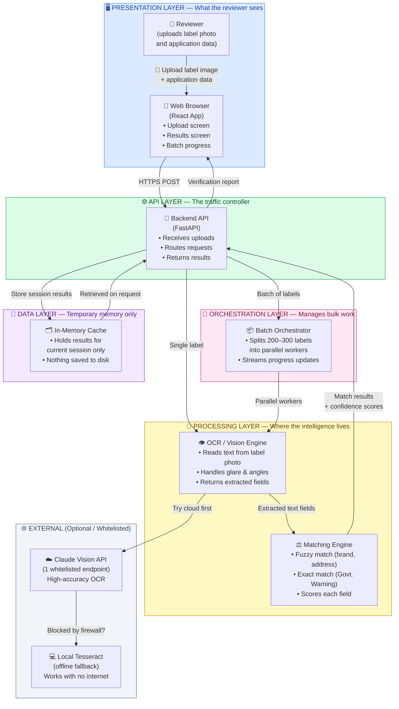
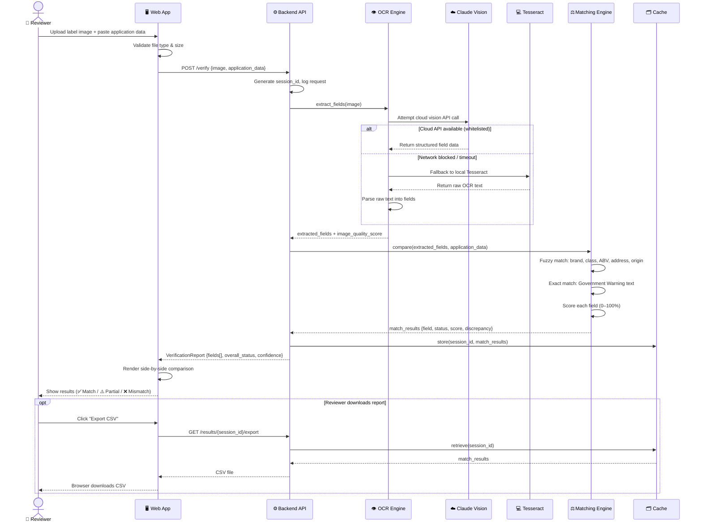
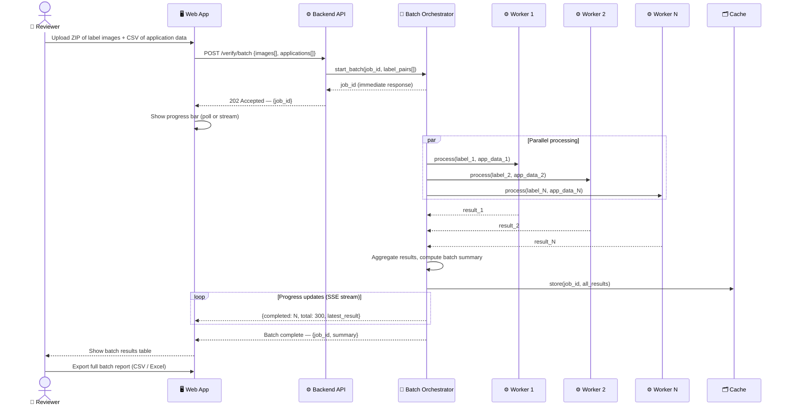
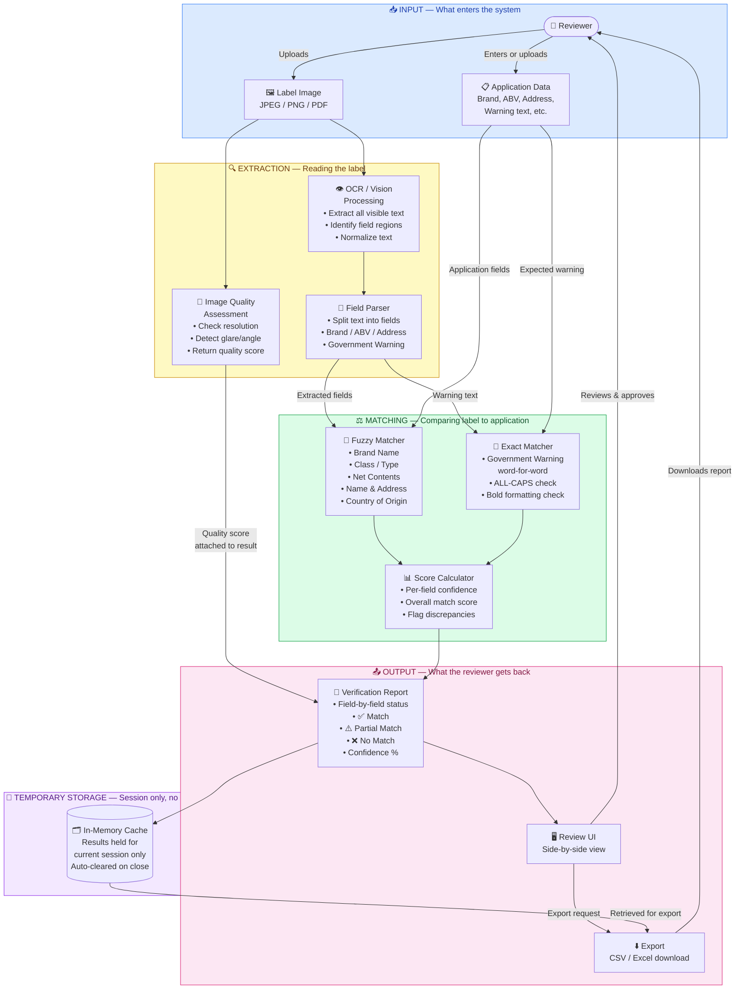

# ADR-001: Alcohol Label Verification PoC — System Architecture

**Status:** Proposed  
**Date:** 2026-06-09  
**Deciders:** Engineering Lead, Product Owner, Treasury Review Team

---

## Context

The TTB (Alcohol and Tobacco Tax and Trade Bureau) currently employs 47 human reviewers processing ~150,000 COLA (Certificate of Label Approval) applications annually. The manual process is bottlenecked on routine data-entry verification — comparing what's printed on a physical label against what was submitted in the application form. This PoC automates that verification step using AI-powered OCR and semantic matching, running in a firewalled government environment.

**Key constraints driving every architectural decision:**
- Strict outbound firewall — no guaranteed internet access
- No integration with legacy .NET COLA system
- No persistent storage of PII or label images
- Must process 1 label in ≤ 5 seconds
- Must handle bulk batches of 200–300 labels
- UI must be operable by users with very low technical literacy

---

## Decision

Build a **containerized, single-node web application** with a React frontend, a Python FastAPI backend, a local vision/OCR engine (Claude Vision via whitelisted endpoint or local Tesseract fallback), and an in-memory processing pipeline. No external database. No persistent image storage.

---

## Options Considered

### Option A: Cloud-first (OpenAI / Anthropic API + cloud DB)
| Dimension | Assessment |
|-----------|------------|
| OCR Accuracy | High |
| Latency | Medium (network round-trip) |
| Firewall Risk | **High — likely blocked** |
| PII Risk | **High — images leave the network** |
| Setup Complexity | Low |

**Pros:** Best-in-class vision models, minimal local compute needed  
**Cons:** Outbound firewall likely blocks it; images containing PII/business data leave the facility — regulatory risk

### Option B: Fully local (Tesseract + local fuzzy match)
| Dimension | Assessment |
|-----------|------------|
| OCR Accuracy | Medium |
| Latency | Very Low |
| Firewall Risk | None |
| PII Risk | None |
| Setup Complexity | Medium |

**Pros:** Air-gapped safe, fast, no data leaves machine  
**Cons:** Tesseract struggles with real-world label photos (glare, curves, low-res)

### Option C: Hybrid — local primary, whitelisted API fallback ✅ **Recommended**
| Dimension | Assessment |
|-----------|------------|
| OCR Accuracy | High (API path) / Medium (local fallback) |
| Latency | ~3–5s (API) / ~1–2s (local) |
| Firewall Risk | Low — only 1 whitelisted endpoint needed |
| PII Risk | Low — images are ephemeral, not stored |
| Setup Complexity | Medium |

**Pros:** Works in both firewalled and open environments; graceful degradation; single whitelisted endpoint minimizes security surface  
**Cons:** Requires IT to whitelist one API endpoint; slight complexity in dual-path logic

---

## Trade-off Analysis

The firewall constraint eliminates pure cloud solutions. A fully local Tesseract approach risks unacceptable OCR accuracy on real-world label photos (curved bottles, glare, partial obstruction). The hybrid model — attempt the whitelisted vision API, fall back to local Tesseract if blocked — satisfies both accuracy and reliability requirements. Since images are processed ephemerally (never written to disk or sent to a database), PII exposure is limited to the in-flight API call, which can be isolated to a single whitelisted domain.

---

## Consequences

- Deployment is a single Docker container — IT installs once, no ongoing cloud dependency
- If IT cannot whitelist the API endpoint, OCR quality degrades but the system still functions
- No horizontal scaling needed for PoC; single-node handles the 200–300 batch requirement via async parallel processing
- Zero long-term data retention — reviewers must export/download results before closing the session

---

## Technology Stack

| Layer | Technology | Rationale |
|-------|-----------|-----------|
| Frontend | React + Tailwind CSS | Fast to build, accessible, single-page |
| Backend API | Python FastAPI | Async support, fast, easy AI library integration |
| Vision / OCR | Claude Vision API (primary) + Tesseract (fallback) | Best accuracy with local safety net |
| Matching Engine | RapidFuzz (Python) | Industry-standard fuzzy matching, MIT license |
| Batch Orchestrator | Python asyncio + concurrent.futures | Parallel label processing without external queue |
| In-Memory Cache | Python dict / Redis (optional) | Ephemeral result storage for session |
| Containerization | Docker + Docker Compose | Single-command deployment |

---

## Action Items

1. [ ] Set up monorepo: `/frontend`, `/backend`, `/docker`
2. [ ] Scaffold FastAPI app with `/verify`, `/verify/batch`, `/health` endpoints
3. [ ] Implement OCR adapter: tries Claude Vision, catches network error, falls back to Tesseract
4. [ ] Implement RapidFuzz matching engine with per-field rules (fuzzy vs. exact)
5. [ ] Build React review UI: upload → results side-by-side → export CSV
6. [ ] Implement batch orchestrator with progress streaming (SSE or WebSocket)
7. [ ] Write Dockerfile + docker-compose.yml
8. [ ] Load test: 300 labels, verify ≤ 5s average, no crashes
9. [ ] Accessibility pass: keyboard nav, WCAG AA contrast, large tap targets

---

## System Architecture Diagram

> **How to read this diagram:** Follow the flow from left (User) to right (AI Engine). Each box is a component of the system. Arrows show how data moves. Color bands show which "layer" each component belongs to.

---

## Sequence Diagram — Single Label Verification

> **How to read this:** Time flows downward. Each vertical line is a system component. Arrows are messages passed between them.

---

## Sequence Diagram — Batch Processing (200–300 Labels)

---

## Data Flow Diagram

> **How to read this:** Rectangles are processes. Rounded rectangles are data stores. Arrows show what data moves where. Circles are external actors.

---

## Implementation Plan

### Phase 1 — Foundation (Week 1)
- [ ] Monorepo setup: `/frontend`, `/backend`, `/docs`, `/docker`
- [ ] FastAPI skeleton: `/health`, `/verify`, `/verify/batch` endpoints
- [ ] Docker + docker-compose: single `docker-compose up` starts everything
- [ ] Basic React shell: upload form + placeholder results panel

### Phase 2 — Core Intelligence (Week 2)
- [ ] OCR adapter: Claude Vision primary → Tesseract fallback
- [ ] Field parser: extract Brand, ABV, Address, Warning, Origin, Net Contents
- [ ] RapidFuzz matching engine with per-field rules
- [ ] Government Warning exact-match validator (word-for-word + formatting)
- [ ] Confidence scoring per field

### Phase 3 — Batch & UI (Week 3)
- [ ] Batch orchestrator: asyncio workers, SSE progress stream
- [ ] React review UI: side-by-side comparison, color-coded field status
- [ ] In-memory cache: store session results, serve export
- [ ] CSV / Excel export endpoint

### Phase 4 — Hardening (Week 4)
- [ ] Imperfect image handling: pre-process with OpenCV (deskew, denoise)
- [ ] Error handling: malformed images, partial OCR, API timeouts
- [ ] Load test: 300 labels, verify ≤ 5s average, zero crashes
- [ ] Accessibility audit: WCAG AA, keyboard nav, large click targets
- [ ] Documentation: README, setup guide, architecture docs (this file)

---

## Appendix — Field Matching Rules Reference

| Field | Match Type | Threshold | Notes |
|-------|-----------|-----------|-------|
| Brand Name | Fuzzy | ≥ 90% | Case & punctuation insensitive |
| Class / Type | Fuzzy | ≥ 85% | Synonym variants allowed |
| ABV / Proof | Exact numeric | ±0.5% tolerance | Parse number from "X% Alc. by Vol." |
| Net Contents | Fuzzy numeric | ±1% tolerance | Handle "750mL" vs "750 ml" |
| Name & Address | Fuzzy | ≥ 80% | Street abbreviations, spacing |
| Country of Origin | Fuzzy | ≥ 90% | "Product of USA" ≈ "United States" |
| Government Warning | **Exact** | 100% | Word-for-word; ALL-CAPS "GOVERNMENT WARNING"; bold prefix required |
