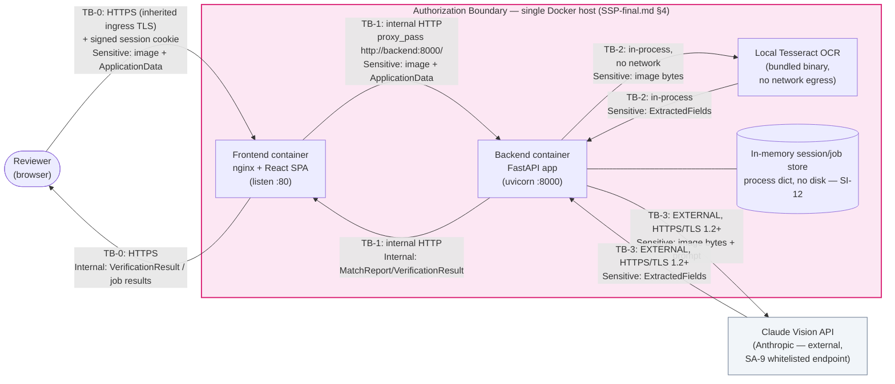

# Data Flow & Trust Boundary Documentation — Alcohol Label Verification PoC

| | |
|---|---|
| **System Name** | Alcohol Label Verification App (ALVA) — TTB COLA Automation PoC |
| **Document Status** | **FINAL** — Phase 4 (ISSUE 4.5, complete FedRAMP documentation package) |
| **Version** | 1.0 |
| **Date** | 2026-06-11 |
| **Issue** | [ISSUE 4.5 — Complete FedRAMP Documentation Package](../../project-management/PROJECT-PLAN.md) |
| **FedRAMP Controls** | **SC-8** (Transmission Confidentiality and Integrity), **AC-4** (Information Flow Enforcement) |
| **Related Documents** | [`ADR-001-System-Architecture.md`](../architecture/ADR-001-System-Architecture.md), [`SSP-final.md`](./SSP-final.md), [`SESSION-MANAGEMENT.md`](./SESSION-MANAGEMENT.md) |
| **Predecessor Document** | [`DATA-FLOW.md`](./DATA-FLOW.md) (ISSUE 1.7 — Draft, Phase 1) |

> **Scope note.** This is the **final** data flow document, covering the system as implemented
> through **Phase 4** (issues 1.1–4.5): validation, OCR adapter + preprocessing, image quality,
> matching engine, Government Warning exact validator, audit logging, the async batch
> orchestrator and session-scoped job store (with TTL expiry), Server-Sent-Events progress
> streaming, and browser session authentication. It documents every data flow in the current
> request surface (`/health`, `/verify`, `/verify/batch`, `/jobs/{job_id}/*`), the trust
> boundaries those flows cross, and incorporates the finalized
> [`SYSTEM-BOUNDARY.png`](./SYSTEM-BOUNDARY.png).

---

## 1. Purpose and Scope

This document satisfies **AC-4 (Information Flow Enforcement)** and **SC-8 (Transmission
Confidentiality and Integrity)** by:

1. Enumerating every data flow between the **Reviewer**, the **frontend (React SPA)**, the
   **backend API (FastAPI)**, the **OCR engines** (local Tesseract and the Claude Vision
   external API), and the in-memory session/job store.
2. Labeling each **trust boundary** the data crosses, classifying it as **internal**
   (within the single-host authorization boundary) or **external** (leaves the
   authorization boundary, e.g. the Anthropic API).
3. Assigning a **data classification** (Sensitive / Internal / Operational) to the payload
   crossing each boundary, so that the correct controls (encryption in transit, logging
   restrictions) are visibly mapped to each flow.
4. Confirming **encryption in transit** for every flow that crosses an external boundary,
   and documenting which internal flows do not (and why that is acceptable given the
   single-host authorization boundary defined in `SSP-final.md` §4).
5. Confirming there are **no data-at-rest paths** for label images or extracted PII —
   all processing is in-memory and ephemeral, including batch session state (SI-12).

This document is the **data-flow companion** to `SSP-final.md` and reuses its system
description (§3), authorization boundary (§4), data type inventory (§5), and PII
declaration (§6). It does not repeat the control-implementation mapping (`SSP-final.md`
§8) except where a specific flow is the evidence for a control.

---

## 2. Data Classification Levels

Three classification levels are used throughout this document, consistent with the data
type inventory in `SSP-final.md` §5:

| Level | Definition | Examples in ALVA | Handling requirement |
|---|---|---|---|
| **Sensitive** | Business-sensitive COLA data and/or data containing PII (the bottler/importer **Name & Address**, per `SSP-final.md` §6). Unauthorized disclosure has Moderate confidentiality impact. | Label image (raw bytes/base64), `ApplicationData` (incl. `name_address`), `ExtractedFields` (incl. `name_address` read off the label) | Encrypted in transit on every external/inherited-ingress hop (SC-8); never written to disk; never logged (AU-3, enforced by `backend/app/audit.py`) |
| **Internal** | Derived results that reference but do not directly restate Sensitive data, used only within the authorization boundary to render the reviewer's UI. | `MatchReport` / `FieldComparison[]`, `GovernmentWarningCheck`, `ImageQualityReport`, `OverallStatus`, `BatchSummary`, `BatchProgress` | Internal-network transmission; not sent to any external system; may appear in API responses to the authenticated reviewer |
| **Operational** | System-generated telemetry about *that* a request happened, with no label content or PII. | Structured audit log events (`request_received`, `ocr_completed`, `match_completed`, `session_expired`, etc. — `backend/app/audit.py`) | Stdout only (AU-9, container log driver); explicitly tested to never contain image bytes, base64 payloads, or `name_address` (`backend/tests/test_audit_logging.py::test_logs_never_contain_pii`) |

---

## 3. Trust Boundaries

The authorization boundary is the **single Docker host** described in `SSP-final.md` §4
(the `alvf-frontend` and `alvf-backend` containers, plus the bundled Tesseract binary —
no database, no object storage). Four trust boundaries (TB-0 .. TB-3) are crossed by data
in this system:

| ID | Boundary | Internal / External | Transport | Source evidence |
|---|---|---|---|---|
| **TB-0** | Reviewer (browser) ↔ Frontend container | **External-to-system, internal-to-TTB-network** — crosses into the authorization boundary from the reviewer's workstation | **HTTPS**, TLS terminated by the hosting GSS ingress (inherited control, `SSP-final.md` §8 SC-8 row); carries the signed session cookie (IA-2/AC-3/SC-23, ISSUE 3.7) | `docker/frontend.Dockerfile`, `docker/nginx/default.conf` (`listen 80`; the container itself serves plain HTTP — TLS termination happens at the inherited ingress) |
| **TB-1** | Frontend container ↔ Backend container | **Internal** — both containers are inside the single-host authorization boundary, on the Docker Compose bridge network | **HTTP** (`proxy_pass http://backend:8000/`), not encrypted — does not leave the authorization boundary | `docker/nginx/default.conf` lines for `location /api/ { proxy_pass http://backend:8000/; ... }` |
| **TB-2** | Backend process ↔ local Tesseract OCR | **Internal, in-process** — not a network call at all | **None** (function call into `pytesseract`, which shells out to the bundled `tesseract-ocr` binary on the same filesystem) | `backend/ocr/adapter.py::_extract_with_tesseract` (`pytesseract.image_to_string(image)`); `docker/backend.Dockerfile` bundles `tesseract-ocr` with no network egress required |
| **TB-3** | Backend container ↔ Claude Vision API (Anthropic) | **External** — leaves the authorization boundary to a third-party service | **HTTPS / TLS 1.2+** via the official `anthropic` Python SDK (`anthropic==0.109.1`), single whitelisted endpoint per SA-9 | `backend/ocr/adapter.py::_extract_with_claude` (`anthropic.Anthropic(api_key=..., timeout=OCR_API_TIMEOUT_SECONDS, max_retries=0)`); conditional on `OCR_MODE != "local"` and `ANTHROPIC_API_KEY` being set |

**Notes:**

- **TB-1 wording reconciled with `SSP-final.md`**: `SSP-draft.md`'s authorization-boundary
  diagram and §7 (System Interconnections) described the frontend→backend hop loosely as
  "HTTPS, same-origin `/api/*` reverse proxy." `SSP-final.md` (ISSUE 4.5) has been corrected to
  match this document: the nginx reverse proxy issues **plain HTTP** to
  `http://backend:8000/` over the internal Docker bridge network, and the frontend container
  itself listens on port 80 (HTTP), not 443. This is **not a gap**: TB-1 never leaves the
  single-host authorization boundary, so it is not subject to the SC-8 requirement for
  *external* transmission.
- **TB-0 now carries session state (ISSUE 3.7)**: every TB-0 request includes the signed
  session cookie issued by `backend/app/session.py`. The cookie is `HttpOnly`, `Secure`,
  `SameSite=Strict`, and HMAC-SHA256-signed (SC-23) — see
  [`SESSION-MANAGEMENT.md`](./SESSION-MANAGEMENT.md).
- **TB-3 fail-open behavior**: `extract_fields()` in `backend/ocr/adapter.py` attempts
  TB-3 first (when configured) and falls over to TB-2 with **no retries**
  (`max_retries=0`) on `APITimeoutError` / `APIConnectionError` / `RateLimitError` /
  `TimeoutError` / `ConnectionError`, so the system degrades to local-only processing
  (TB-2 only) in a firewalled/air-gapped environment, or when the upstream rate limit is
  exceeded, rather than blocking the reviewer (SI-10/ADR-001).
- **TB-0 is an inherited control**: per `SSP-final.md` §1, ALVA is a Minor Application that
  does not provision its own network perimeter or TLS termination — TB-0's HTTPS
  termination is provided by the hosting GSS ingress.

---

## 4. End-to-End Data Flows

The data flow follows the acceptance-criteria sequence **Reviewer → UI → API → OCR Engine
→ External API** for every label processed. Both entry points (`/verify` and
`/verify/batch`) share the same OCR/quality/preprocessing/matching pipeline via
`backend/app/pipeline.py::run_verification()` (ISSUE 4.4); `/verify/batch` additionally
persists results in the session-scoped in-memory job store for later retrieval and streams
progress over Server-Sent Events.

### 4.1 Single-label verification — `POST /verify`

Every request below also carries the signed session cookie (IA-2/AC-3/SC-23, ISSUE 3.7),
validated by `backend/app/session.py` middleware before any other processing — this is a
cross-cutting concern applied uniformly and not repeated as a separate row.

| Step | From → To | Boundary | Data | Classification |
|---|---|---|---|---|
| 1 | Reviewer → Frontend | TB-0 (HTTPS, inherited ingress) | Base64-encoded label image + `ApplicationData` (incl. `name_address`), submitted via the React form | Sensitive |
| 2 | Frontend → Backend | TB-1 (internal HTTP, `/api/verify` → `http://backend:8000/verify`) | Same `VerifyRequest` body, proxied verbatim by nginx | Sensitive |
| 3 | Backend → Backend (validation) | — (in-process) | `decode_base64_image()` + `validate_image_bytes()` (`backend/app/validation.py`) — magic-byte check, `MAX_IMAGE_MB` size check (413/415 on failure) | Sensitive |
| 4 | Backend → Backend (quality + preprocessing) | — (in-process) | `assess_image_quality()` (`backend/ocr/quality.py`) decodes the image into an in-memory OpenCV array and returns an `ImageQualityReport`. If the quality score is ≤ 80, `backend/ocr/preprocessor.py::maybe_preprocess` (ISSUE 4.1) deskews, denoises, sharpens, and contrast-enhances a copy of the image before OCR; preprocessing never raises and degrades back to the original bytes on any failure | Sensitive in (image bytes) → Internal out (quality score/issues) |
| 5a | Backend → Claude Vision API | **TB-3 (external, HTTPS/TLS 1.2+)** | `_extract_with_claude()`: image bytes base64-re-encoded into the Anthropic Messages API request body, plus the fixed extraction prompt (`backend/ocr/adapter.py`) | Sensitive (request) |
| 5b | Claude Vision API → Backend | **TB-3 (external, HTTPS/TLS 1.2+)** | Structured `record_label_fields` tool-call response → `ExtractedFields` (incl. `name_address` read off the label, `confidence_score`, `ocr_engine_used=claude_vision`) | Sensitive |
| 5c *(fallback)* | Backend → Tesseract → Backend | TB-2 (in-process, no network) | On TB-3 timeout/connection error (or `OCR_MODE=local` / no API key), `_extract_with_tesseract()` runs `pytesseract.image_to_string()` against the same in-memory image and returns `ExtractedFields` with `ocr_engine_used=tesseract` | Sensitive |
| 6 | Backend → Backend (matching) | — (in-process) | Matching engine compares `ExtractedFields` to `ApplicationData`; `exact_validator.py` performs the word-for-word Government Warning check; results assembled into `MatchReport` / `GovernmentWarningCheck` by `pipeline.run_verification()`. An unreadable image or any pipeline exception returns `overall_status: "ERROR"` with a plain-language message instead of crashing (SI-17, ISSUE 4.4) | Sensitive in → Internal out |
| 7 | Backend → Backend (audit log) | — (stdout) | `log_ocr_started` / `log_ocr_completed` / `log_match_completed` emit structured JSON with `request_id`, `session_id`, `ocr_engine_used`, `confidence_score`, `overall_status` only — **no image bytes, base64, or `name_address`** (enforced by `test_logs_never_contain_pii`) | Operational |
| 8 | Backend → Frontend | TB-1 (internal HTTP) | `VerificationResult` (fields, `government_warning`, `image_quality_score`, `confidence_score`, `ocr_engine_used`, `overall_status`, plain-language `message`) | Internal |
| 9 | Frontend → Reviewer | TB-0 (HTTPS, inherited ingress) | Rendered field-by-field comparison UI | Internal |

### 4.2 Batch verification — `POST /verify/batch` + `GET /jobs/{job_id}/*`

| Step | From → To | Boundary | Data | Classification |
|---|---|---|---|---|
| 1 | Reviewer → Frontend → Backend | TB-0, then TB-1 | Multiple label images (`UploadFile[]`) + an `application_csv` (one row per image), `multipart/form-data` | Sensitive |
| 2 | Backend → Backend (validation) | — (in-process) | `validate_upload()` per image (magic-byte/size/filename checks, `backend/app/validation.py`); `validate_batch_size()` enforces the cumulative `MAX_BATCH_MB` (default 500MB, HTTP 413, ISSUE 3.6); `application_csv` parsed by `backend/batch/csv_input.py` (rejects unknown/missing columns, HTTP 422) | Sensitive |
| 3 | Backend → in-memory job store | — (process memory, `backend/batch/store.py`) | `store.create_job(total=len(images), session_id=...)` creates a `Job` (dataclass) keyed by a `secrets.token_urlsafe(12)` `job_id`, scoped to the requesting session's `session_id` — **no disk or database** | Internal (job metadata only at this point) |
| 4 | Backend → Frontend → Reviewer | TB-1, then TB-0 | `BatchSubmitResponse` (`job_id`, `state`, `total`) | Internal |
| 5 | *(async orchestrator, ISSUE 3.1)* | TB-2 / TB-3 per image | `backend/batch/orchestrator.py` processes each queued image through `pipeline.run_verification()` (same steps 3–7 of §4.1, including preprocessing, ISSUE 4.1), appending a `VerificationResult` to `job.results`. A per-label exception is isolated to that label's result — the remaining labels continue processing (SI-17/AC4, ISSUE 4.4) | Sensitive → Internal |
| 6 | Backend → Frontend → Reviewer | TB-1, then TB-0 | `GET /jobs/{job_id}/stream` — Server-Sent Events (ISSUE 3.2): the backend pushes a `BatchProgress`/`VerificationResult` event each time a label finishes, consumed via the browser's native `EventSource` (`frontend/src/hooks/useJobStream.js`), which auto-reconnects on a dropped connection and surfaces a "Reconnecting…" status (ISSUE 4.4 AC6) | Internal |
| 7 | Reviewer → Frontend → Backend | TB-0, then TB-1 | `GET /jobs/{job_id}/status` and `GET /jobs/{job_id}/results` remain available as a polling fallback to the SSE stream | Internal |
| 8 | Backend → Frontend → Reviewer | TB-1, then TB-0 | `JobStatusResponse` / `JobResultsResponse` (`BatchSummary` + `VerificationResult[]`) | Internal |
| 9 | Reviewer → Frontend → Backend → Frontend → Reviewer | TB-0/TB-1 round trip | `GET /jobs/{job_id}/export?format=csv\|xlsx` — backend builds the export **in memory** (`io.StringIO` for CSV, an `openpyxl` workbook for XLSX, ISSUE 3.5) with every cell sanitized against CSV/XLSX formula injection (CWE-1236), and streams it back as `text/csv` or `application/vnd.openxmlformats-officedocument.spreadsheetml.sheet`; never written to disk | Internal |
| 10 | Reviewer → Frontend → Backend | TB-0, then TB-1 | **Session ownership (AC-3, ISSUE 3.7)**: every `/jobs/*` request is scoped to the session that created the job — `store.get_job(job_id)` returns `None` (→ HTTP 404) for any session other than the creator | Internal |
| 11 | Backend (background, on next `create_job`/`get_job`) | — (in-process) | **TTL reaping (SI-12, ISSUE 3.5)**: `store._reap_expired()` drops any job idle longer than `SESSION_TTL_HOURS` (default 4h) and emits a `session_expired` audit event (see §4.3) | Operational |

### 4.3 Audit logging (cross-cutting)

Every request through `/health`, `/verify`, `/verify/batch`, and `/jobs/*` emits
`request_received` / `request_completed` (and `request_error` on failure) structured log
events to **stdout only** (`backend/app/audit.py::configure_logging`, `structlog`
`PrintLoggerFactory`). These events carry `request_id`, `endpoint`, `method`,
`status_code`, `duration_ms`, `session_id`, and `ocr_engine_used` — never the image, its
base64 encoding, or `name_address`. In addition, `session_expired` (SI-12, ISSUE 3.5) is
emitted by `backend/batch/store.py::_reap_expired` when an idle job is dropped, carrying
only `session_id` (§4.2 step 11). A second, independently-reaped `session_expired` event is
emitted by `backend/app/session.py::_reap_expired` (and lazily on session lookup) when an
*authenticated browser session* — not a batch job — is dropped after `SESSION_TTL_HOURS` of
inactivity (SC-23/IA-2, see [`SESSION-MANAGEMENT.md`](./SESSION-MANAGEMENT.md)); both events
share the same field name and `session_id` value space but represent two
independently-TTL'd resources and may not fire at the same time. This flow does not cross
TB-0/TB-1/TB-3; it terminates at the container's stdout, which is collected by the container
log driver (an inherited control per `SSP-final.md` §8 AU-9). See **Operational**
classification in §2.

---

## 5. Trust Boundary Diagram

A complementary full-system authorization-boundary view — including the corrected TB-1
(internal HTTP) wording and the session-cookie flow — is published as
[`SYSTEM-BOUNDARY.png`](./SYSTEM-BOUNDARY.png) (`SSP-final.md` §4, AC7).

---

## 6. Encryption in Transit Summary (SC-8)

| Boundary | Encrypted in transit? | Mechanism | Notes |
|---|---|---|---|
| TB-0 (Reviewer ↔ Frontend) | **Yes** | TLS, terminated at the hosting GSS ingress | Inherited control (`SSP-final.md` §1, §7). The session cookie is marked `Secure`, so it is only ever transmitted over this TLS connection (SC-23) |
| TB-1 (Frontend ↔ Backend) | No (plain HTTP) | Docker Compose bridge network, container-to-container | **Acceptable**: traffic never leaves the single-host authorization boundary, so SC-8's "external transmission" requirement does not apply. Documented here per AC-4 to make the flow explicit, not as a gap |
| TB-2 (Backend ↔ Tesseract) | N/A | In-process function call, no network stack involved | No transmission occurs |
| TB-3 (Backend ↔ Claude Vision API) | **Yes** | HTTPS / TLS 1.2+ enforced by the `anthropic` SDK (`anthropic==0.109.1`) against `api.anthropic.com` | Single whitelisted external endpoint (SA-9); conditional on `OCR_MODE`/`ANTHROPIC_API_KEY`; `max_retries=0` with fail-over to TB-2 on connection/timeout errors |

All flows that cross the authorization boundary (TB-0, TB-3) are encrypted in transit.
The one unencrypted flow (TB-1) is internal to the boundary and carries no traffic outside
the single Docker host.

---

## 7. Data-at-Rest Confirmation — Ephemeral Processing

**No data-at-rest paths exist for label images, extracted fields, application data, or
session/batch state.** All processing across both OCR engines and the batch job store is
in-memory only:

| Component | File | In-memory mechanism | Disk/DB writes? |
|---|---|---|---|
| Image quality assessment | `backend/ocr/quality.py` | `Image.open(io.BytesIO(image_bytes))` → `cv2.cvtColor(np.array(...))` — decodes directly from the in-memory byte buffer into an OpenCV array | None |
| Image preprocessing | `backend/ocr/preprocessor.py` | `maybe_preprocess` (ISSUE 4.1) operates on an in-memory OpenCV copy (deskew/denoise/sharpen/contrast) and returns bytes; never raises, degrades to original bytes on failure | None |
| Tesseract OCR fallback | `backend/ocr/adapter.py::_extract_with_tesseract` | `Image.open(io.BytesIO(image_bytes))` passed straight to `pytesseract.image_to_string()` | None — `pytesseract` reads the in-memory PIL image; no temp files are created by this code path |
| Claude Vision OCR | `backend/ocr/adapter.py::_extract_with_claude` | Image bytes base64-encoded in memory and sent as the request body; response parsed in memory | None |
| Session/batch job store | `backend/batch/store.py` | Process-local `dict[str, Job]`, `Job` is a `dataclass` holding `session_id`, `results: list[VerificationResult]`, and `last_accessed`. `_reap_expired()` (ISSUE 3.5, SI-12) drops jobs idle longer than `SESSION_TTL_HOURS` | None — cleared on process restart or TTL expiry; in-memory only, not Redis/disk-backed |
| CSV/XLSX export | `backend/app/routers/jobs.py::job_export` | `csv.writer` → `io.StringIO()` (CSV) or `openpyxl.Workbook` → `io.BytesIO()` (XLSX, ISSUE 3.5), returned directly as an HTTP response body, with formula-injection-safe cell sanitization | None |
| Audit logs | `backend/app/audit.py` | `structlog` `PrintLoggerFactory` → stdout | Container log driver only (Operational data, no PII — §2) |

A repository-wide search for filesystem-write patterns (`open(`, `.write(`, `.save(`,
`tempfile`, `NamedTemporaryFile`, `shutil.copy`) across `backend/**/*.py` returns matches
only in `backend/ocr/quality.py`, `backend/ocr/preprocessor.py`, and
`backend/ocr/adapter.py`, all of which are the `io.BytesIO(...)` / in-memory OpenCV
operations listed above — **no match corresponds to an actual filesystem write of label
image bytes or extracted/application/session data**. This substantiates the **SI-12
(Information Management and Retention)** "ephemeral processing" claim in `SSP-final.md` §8.

---

## 8. References

- [`ADR-001-System-Architecture.md`](../architecture/ADR-001-System-Architecture.md) —
  canonical system architecture, sequence diagrams (single-label and batch), and the
  original data flow diagram this document refines into trust-boundary terms.
- [`SSP-final.md`](./SSP-final.md) — §4 (Authorization Boundary), §5 (Data Types
  Inventory), §6 (PII Handling), §7 (System Interconnections), §8 (Minimum Security Controls).
- [`SESSION-MANAGEMENT.md`](./SESSION-MANAGEMENT.md) — session cookie issuance, validation,
  and TTL details (IA-2, AC-3, SC-23, ISSUE 3.7).
- [`PREPROCESSING-AB-TEST.md`](./PREPROCESSING-AB-TEST.md) — preprocessing before/after
  quality comparison (SI-10, ISSUE 4.1).
- `docker/nginx/default.conf` — TB-0/TB-1 transport evidence.
- `backend/ocr/adapter.py`, `backend/ocr/preprocessor.py` — TB-2/TB-3 transport evidence,
  fail-over behavior, and preprocessing.
- `backend/app/audit.py`, `backend/tests/test_audit_logging.py` — audit logging /
  Operational classification evidence (AU-2, AU-3, AU-9).
- `backend/app/session.py` — session cookie issuance/validation middleware (IA-2, AC-3, SC-23).
- `backend/app/pipeline.py` — consolidated OCR/quality/matching pipeline shared by
  `/verify` and `/verify/batch` (ISSUE 4.4).
- `backend/batch/store.py`, `backend/batch/orchestrator.py`, `backend/app/routers/jobs.py` —
  session-scoped in-memory job store, async orchestrator, CSV/XLSX export, data-at-rest
  confirmation (SI-12).

---

## Final Status

This document is the **final** data flow and trust boundary documentation delivered under
**ISSUE 4.5 — Complete FedRAMP Documentation Package** (Phase 4). Relative to `DATA-FLOW.md`,
this revision:

- Extends §4.2 with the Phase 3 async orchestrator (ISSUE 3.1), the session-scoped job store
  with TTL expiry (ISSUE 3.5, step 11), and the `session_expired` audit event (§4.3).
- Adds the Phase 3 batch-size validation (`MAX_BATCH_MB`, ISSUE 3.6, step 2), the SSE
  progress stream (`/jobs/{job_id}/stream`, ISSUE 3.2, step 6), session ownership
  enforcement (AC-3, ISSUE 3.7, step 10), image preprocessing (ISSUE 4.1, §4.1 step 4 /
  §4.2 step 5), and the pipeline consolidation + fail-safe isolation (ISSUE 4.4).
- Incorporates the finalized [`SYSTEM-BOUNDARY.png`](./SYSTEM-BOUNDARY.png) (§5).
- Reconciles `SSP-final.md`'s authorization boundary diagram and §7 interconnections table
  with the TB-1 (internal HTTP) correction made in §3 of this document — both documents
  now agree.
- Corrects stale `backend/app/jobstore.py` references to the current `backend/batch/store.py`
  (moved in ISSUE 3.1).
