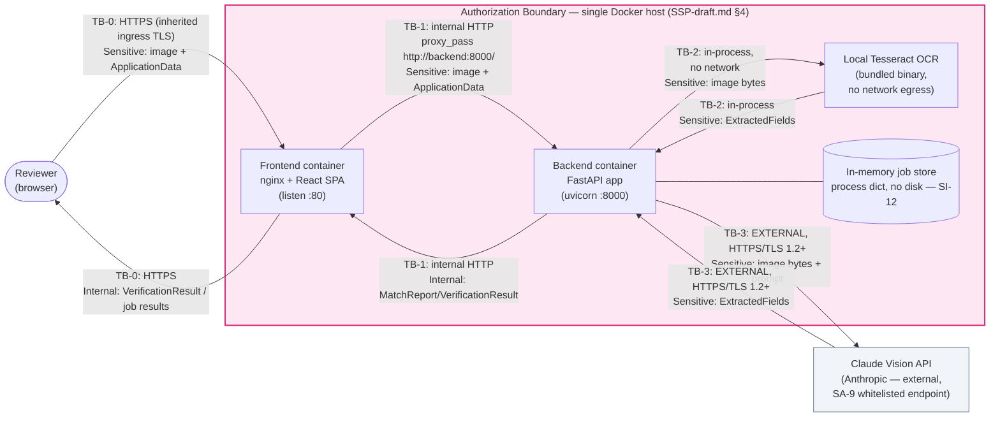

# Data Flow & Trust Boundary Documentation (Draft) — Alcohol Label Verification PoC

| | |
|---|---|
| **System Name** | Alcohol Label Verification App (ALVA) — TTB COLA Automation PoC |
| **Document Status** | **DRAFT** — Phase 1 (PL-2 / SC-8 / AC-4) |
| **Version** | 0.1 (draft) |
| **Date** | 2026-06-10 |
| **Issue** | [ISSUE 1.7 — Define Data Flow & Trust Boundary Documentation](../../project-management/PROJECT-PLAN.md) |
| **FedRAMP Controls** | **SC-8** (Transmission Confidentiality and Integrity), **AC-4** (Information Flow Enforcement) |
| **Related Documents** | [`ADR-001-System-Architecture.md`](../architecture/ADR-001-System-Architecture.md), [`SSP-draft.md`](./SSP-draft.md) |
| **Successor Document** | [`DATA-FLOW-final.md`](./DATA-FLOW-final.md) (ISSUE 4.5 — Complete FedRAMP Documentation Package) |

> **Scope note.** This is a **draft** data flow document, written against the system as
> implemented through Phase 2 (issues 1.1–2.7: validation, OCR adapter, image quality,
> matching engine, Government Warning exact validator, audit logging). It documents every
> data flow in the current request surface (`/health`, `/verify`, `/verify/batch`,
> `/jobs/{job_id}/*`) and the trust boundaries those flows cross. `DATA-FLOW-final.md`
> (ISSUE 4.5) will extend this to the Phase 3 async orchestrator, session store, and
> rate limiting, and incorporate the finalized `SYSTEM-BOUNDARY.png`.

---

## 1. Purpose and Scope

This document satisfies **AC-4 (Information Flow Enforcement)** and **SC-8 (Transmission
Confidentiality and Integrity)** by:

1. Enumerating every data flow between the **Reviewer**, the **frontend (React SPA)**, the
   **backend API (FastAPI)**, the **OCR engines** (local Tesseract and the Claude Vision
   external API), and the in-memory job store.
2. Labeling each **trust boundary** the data crosses, classifying it as **internal**
   (within the single-host authorization boundary) or **external** (leaves the
   authorization boundary, e.g. the Anthropic API).
3. Assigning a **data classification** (Sensitive / Internal / Operational) to the payload
   crossing each boundary, so that the correct controls (encryption in transit, logging
   restrictions) are visibly mapped to each flow.
4. Confirming **encryption in transit** for every flow that crosses an external boundary,
   and documenting which internal flows do not (and why that is acceptable given the
   single-host authorization boundary defined in `SSP-draft.md` §4).
5. Confirming there are **no data-at-rest paths** for label images or extracted PII —
   all processing is in-memory and ephemeral.

This document is the **data-flow companion** to `SSP-draft.md` and reuses its system
description (§3), authorization boundary (§4), data type inventory (§5), and PII
declaration (§7). It does not repeat the control-implementation mapping (`SSP-draft.md`
§9) except where a specific flow is the evidence for a control.

---

## 2. Data Classification Levels

Three classification levels are used throughout this document, consistent with the data
type inventory in `SSP-draft.md` §5:

| Level | Definition | Examples in ALVA | Handling requirement |
|---|---|---|---|
| **Sensitive** | Business-sensitive COLA data and/or data containing PII (the bottler/importer **Name & Address**, per `SSP-draft.md` §7). Unauthorized disclosure has Moderate confidentiality impact. | Label image (raw bytes/base64), `ApplicationData` (incl. `name_address`), `ExtractedFields` (incl. `name_address` read off the label) | Encrypted in transit on every external/inherited-ingress hop (SC-8); never written to disk; never logged (AU-3, enforced by `backend/app/audit.py`) |
| **Internal** | Derived results that reference but do not directly restate Sensitive data, used only within the authorization boundary to render the reviewer's UI. | `MatchReport` / `FieldComparison[]`, `GovernmentWarningCheck`, `ImageQualityReport`, `OverallStatus`, `BatchSummary` | Internal-network transmission; not sent to any external system; may appear in API responses to the authenticated reviewer |
| **Operational** | System-generated telemetry about *that* a request happened, with no label content or PII. | Structured audit log events (`request_received`, `ocr_completed`, `match_completed`, etc. — `backend/app/audit.py`) | Stdout only (AU-9, container log driver); explicitly tested to never contain image bytes, base64 payloads, or `name_address` (`backend/tests/test_audit_logging.py::test_logs_never_contain_pii`) |

---

## 3. Trust Boundaries

The authorization boundary is the **single Docker host** described in `SSP-draft.md` §4
(the `alvf-frontend` and `alvf-backend` containers, plus the bundled Tesseract binary —
no database, no object storage). Four trust boundaries (TB-0 .. TB-3) are crossed by data
in this system:

| ID | Boundary | Internal / External | Transport | Source evidence |
|---|---|---|---|---|
| **TB-0** | Reviewer (browser) ↔ Frontend container | **External-to-system, internal-to-TTB-network** — crosses into the authorization boundary from the reviewer's workstation | **HTTPS**, TLS terminated by the hosting GSS ingress (inherited control, `SSP-draft.md` §9 SC-8 row) | `docker/frontend.Dockerfile`, `docker/nginx/default.conf` (`listen 80`; the container itself serves plain HTTP — TLS termination happens at the inherited ingress) |
| **TB-1** | Frontend container ↔ Backend container | **Internal** — both containers are inside the single-host authorization boundary, on the Docker Compose bridge network | **HTTP** (`proxy_pass http://backend:8000/`), not encrypted — does not leave the authorization boundary | `docker/nginx/default.conf` lines for `location /api/ { proxy_pass http://backend:8000/; ... }` |
| **TB-2** | Backend process ↔ local Tesseract OCR | **Internal, in-process** — not a network call at all | **None** (function call into `pytesseract`, which shells out to the bundled `tesseract-ocr` binary on the same filesystem) | `backend/ocr/adapter.py::_extract_with_tesseract` (`pytesseract.image_to_string(image)`); `docker/backend.Dockerfile` bundles `tesseract-ocr` with no network egress required |
| **TB-3** | Backend container ↔ Claude Vision API (Anthropic) | **External** — leaves the authorization boundary to a third-party service | **HTTPS / TLS 1.2+** via the official `anthropic` Python SDK (`anthropic==0.109.1`), single whitelisted endpoint per SA-9 | `backend/ocr/adapter.py::_extract_with_claude` (`anthropic.Anthropic(api_key=..., timeout=OCR_API_TIMEOUT_SECONDS, max_retries=0)`); conditional on `OCR_MODE != "local"` and `ANTHROPIC_API_KEY` being set |

**Notes:**

- **TB-1 correction vs. `SSP-draft.md`**: The SSP draft's authorization-boundary diagram and
  §9 (System Interconnections) describe the frontend→backend hop loosely as "HTTPS,
  same-origin `/api/*` reverse proxy." Reading `docker/nginx/default.conf` confirms the
  nginx reverse proxy issues **plain HTTP** to `http://backend:8000/` over the internal
  Docker bridge network, and the frontend container itself listens on port 80 (HTTP), not
  443. This is **not a gap**: TB-1 never leaves the single-host authorization boundary, so
  it is not subject to the SC-8 requirement for *external* transmission. `SSP-draft.md`'s
  wording will be tightened in `SSP-final.md` (ISSUE 4.5) to match this document.
- **TB-3 fail-open behavior**: `extract_fields()` in `backend/ocr/adapter.py` attempts
  TB-3 first (when configured) and falls over to TB-2 with **no retries**
  (`max_retries=0`) on `APITimeoutError` / `APIConnectionError` / `TimeoutError` /
  `ConnectionError`, so the system degrades to local-only processing (TB-2 only) in a
  firewalled/air-gapped environment rather than blocking the reviewer (SI-10/ADR-001).
- **TB-0 is an inherited control**: per `SSP-draft.md` §1, ALVA is a Minor Application that
  does not provision its own network perimeter or TLS termination — TB-0's HTTPS
  termination is provided by the hosting GSS ingress.

---

## 4. End-to-End Data Flows

The data flow follows the acceptance-criteria sequence **Reviewer → UI → API → OCR Engine
→ External API** for every label processed. The two entry points (`/verify` and
`/verify/batch`) share the same OCR/quality pipeline; `/verify/batch` additionally
persists results in the in-memory job store for later retrieval.

### 4.1 Single-label verification — `POST /verify`

| Step | From → To | Boundary | Data | Classification |
|---|---|---|---|---|
| 1 | Reviewer → Frontend | TB-0 (HTTPS, inherited ingress) | Base64-encoded label image + `ApplicationData` (incl. `name_address`), submitted via the React form | Sensitive |
| 2 | Frontend → Backend | TB-1 (internal HTTP, `/api/verify` → `http://backend:8000/verify`) | Same `VerifyRequest` body, proxied verbatim by nginx | Sensitive |
| 3 | Backend → Backend (validation) | — (in-process) | `decode_base64_image()` + `validate_image_bytes()` (`backend/app/validation.py`) — magic-byte check, `MAX_IMAGE_MB` size check (413/415 on failure) | Sensitive |
| 4 | Backend → Backend (quality) | — (in-process) | `assess_image_quality()` (`backend/ocr/quality.py`) decodes the image into an in-memory OpenCV array (`io.BytesIO` → `Image.open` → `cv2.cvtColor(np.array(...))`) and returns an `ImageQualityReport` | Sensitive in (image bytes) → Internal out (quality score/issues) |
| 5a | Backend → Claude Vision API | **TB-3 (external, HTTPS/TLS 1.2+)** | `_extract_with_claude()`: image bytes base64-re-encoded into the Anthropic Messages API request body, plus the fixed extraction prompt (`backend/ocr/adapter.py`) | Sensitive (request) |
| 5b | Claude Vision API → Backend | **TB-3 (external, HTTPS/TLS 1.2+)** | Structured `record_label_fields` tool-call response → `ExtractedFields` (incl. `name_address` read off the label, `confidence_score`, `ocr_engine_used=claude_vision`) | Sensitive |
| 5c *(fallback)* | Backend → Tesseract → Backend | TB-2 (in-process, no network) | On TB-3 timeout/connection error (or `OCR_MODE=local` / no API key), `_extract_with_tesseract()` runs `pytesseract.image_to_string()` against the same in-memory image and returns `ExtractedFields` with `ocr_engine_used=tesseract` | Sensitive |
| 6 | Backend → Backend (matching) | — (in-process) | Matching engine compares `ExtractedFields` to `ApplicationData`; `exact_validator.py` performs the word-for-word Government Warning check; results assembled into `MatchReport` / `GovernmentWarningCheck` | Sensitive in → Internal out |
| 7 | Backend → Backend (audit log) | — (stdout) | `log_ocr_started` / `log_ocr_completed` / `log_match_completed` emit structured JSON with `request_id`, `session_id`, `ocr_engine_used`, `confidence_score`, `overall_status` only — **no image bytes, base64, or `name_address`** (enforced by `test_logs_never_contain_pii`) | Operational |
| 8 | Backend → Frontend | TB-1 (internal HTTP) | `VerificationResult` (fields, `government_warning`, `image_quality_score`, `confidence_score`, `ocr_engine_used`, `overall_status`) | Internal |
| 9 | Frontend → Reviewer | TB-0 (HTTPS, inherited ingress) | Rendered field-by-field comparison UI | Internal |

### 4.2 Batch verification — `POST /verify/batch` + `GET /jobs/{job_id}/*`

| Step | From → To | Boundary | Data | Classification |
|---|---|---|---|---|
| 1 | Reviewer → Frontend → Backend | TB-0, then TB-1 | Multiple label images (`UploadFile[]`) + an `application_csv` (one row per image), `multipart/form-data` | Sensitive |
| 2 | Backend → Backend (validation) | — (in-process) | `validate_upload()` per image (content-type/size/filename checks, `backend/app/validation.py`) | Sensitive |
| 3 | Backend → in-memory job store | — (process memory, `backend/app/jobstore.py`) | `jobstore.create_job(total=len(images))` creates a `Job` (dataclass) keyed by a `secrets.token_urlsafe(12)` `job_id`, held in a process-local `dict[str, Job]` — **no disk or database** | Internal (job metadata only at this point) |
| 4 | Backend → Frontend → Reviewer | TB-1, then TB-0 | `BatchSubmitResponse` (`job_id`, `state`, `total`) | Internal |
| 5 | *(Phase 3 orchestrator, ISSUE 3.1)* | TB-2 / TB-3 per image | Each queued image runs the same steps 3–7 of §4.1 (quality → OCR via TB-2/TB-3 → matching → audit log), appending a `VerificationResult` to `job.results` | Sensitive → Internal |
| 6 | Reviewer → Frontend → Backend | TB-0, then TB-1 | `GET /jobs/{job_id}/status` (poll), `GET /jobs/{job_id}/results` | Internal |
| 7 | Backend → Frontend → Reviewer | TB-1, then TB-0 | `JobStatusResponse` / `JobResultsResponse` (`BatchSummary` + `VerificationResult[]`) | Internal |
| 8 | Reviewer → Frontend → Backend → Frontend → Reviewer | TB-0/TB-1 round trip | `GET /jobs/{job_id}/export` — backend builds a CSV **in an in-memory `io.StringIO()` buffer** (`backend/app/routers/jobs.py::job_export`) and streams it back as `text/csv`; never written to disk | Internal |

### 4.3 Audit logging (cross-cutting)

Every request through `/health`, `/verify`, `/verify/batch`, and `/jobs/*` emits
`request_received` / `request_completed` (and `request_error` on failure) structured log
events to **stdout only** (`backend/app/audit.py::configure_logging`, `structlog`
`PrintLoggerFactory`). These events carry `request_id`, `endpoint`, `method`,
`status_code`, `duration_ms`, `session_id`, and `ocr_engine_used` — never the image, its
base64 encoding, or `name_address`. This flow does not cross TB-0/TB-1/TB-3; it terminates
at the container's stdout, which is collected by the container log driver (an inherited
control per `SSP-draft.md` §9). See **Operational** classification in §2.

---

## 5. Trust Boundary Diagram

---

## 6. Encryption in Transit Summary (SC-8)

| Boundary | Encrypted in transit? | Mechanism | Notes |
|---|---|---|---|
| TB-0 (Reviewer ↔ Frontend) | **Yes** | TLS, terminated at the hosting GSS ingress | Inherited control (`SSP-draft.md` §1, §9) — ALVA does not terminate TLS itself |
| TB-1 (Frontend ↔ Backend) | No (plain HTTP) | Docker Compose bridge network, container-to-container | **Acceptable**: traffic never leaves the single-host authorization boundary, so SC-8's "external transmission" requirement does not apply. Documented here per AC-4 to make the flow explicit, not as a gap |
| TB-2 (Backend ↔ Tesseract) | N/A | In-process function call, no network stack involved | No transmission occurs |
| TB-3 (Backend ↔ Claude Vision API) | **Yes** | HTTPS / TLS 1.2+ enforced by the `anthropic` SDK (`anthropic==0.109.1`) against `api.anthropic.com` | Single whitelisted external endpoint (SA-9); conditional on `OCR_MODE`/`ANTHROPIC_API_KEY`; `max_retries=0` with fail-over to TB-2 on connection/timeout errors |

All flows that cross the authorization boundary (TB-0, TB-3) are encrypted in transit.
The one unencrypted flow (TB-1) is internal to the boundary and carries no traffic outside
the single Docker host.

---

## 7. Data-at-Rest Confirmation — Ephemeral Processing

**No data-at-rest paths exist for label images, extracted fields, or application data.**
All processing across both OCR engines and the batch job store is in-memory only:

| Component | File | In-memory mechanism | Disk/DB writes? |
|---|---|---|---|
| Image quality assessment | `backend/ocr/quality.py` | `Image.open(io.BytesIO(image_bytes))` → `cv2.cvtColor(np.array(...))` — decodes directly from the in-memory byte buffer into an OpenCV array | None |
| Tesseract OCR fallback | `backend/ocr/adapter.py::_extract_with_tesseract` | `Image.open(io.BytesIO(image_bytes))` passed straight to `pytesseract.image_to_string()` | None — `pytesseract` reads the in-memory PIL image; no temp files are created by this code path |
| Claude Vision OCR | `backend/ocr/adapter.py::_extract_with_claude` | Image bytes base64-encoded in memory and sent as the request body; response parsed in memory | None |
| Batch job store | `backend/app/jobstore.py` | Process-local `dict[str, Job]`, `Job` is a `dataclass` holding `results: list[VerificationResult]` | None — cleared on process restart (Phase 1 stub; ISSUE 3.5 adds TTL-based expiry, still in-memory/Redis-backed, not disk) |
| CSV export | `backend/app/routers/jobs.py::job_export` | `csv.writer` writes into an `io.StringIO()` buffer, returned directly as an HTTP response body | None |
| Audit logs | `backend/app/audit.py` | `structlog` `PrintLoggerFactory` → stdout | Container log driver only (Operational data, no PII — §2) |

A repository-wide search for filesystem-write patterns (`open(`, `.write(`, `.save(`,
`tempfile`, `NamedTemporaryFile`, `shutil.copy`) across `backend/**/*.py` returns matches
only in `backend/ocr/quality.py` and `backend/ocr/adapter.py`, both of which are the
`io.BytesIO(...)` in-memory reads listed above — **no match corresponds to an actual
filesystem write of label image bytes or extracted/application data**. This substantiates
the **SI-12 (Information Management and Retention)** "ephemeral processing" claim in
`SSP-draft.md` §9.

---

## 8. References

- [`ADR-001-System-Architecture.md`](../architecture/ADR-001-System-Architecture.md) —
  canonical system architecture, sequence diagrams (single-label and batch), and the
  original data flow diagram this document refines into trust-boundary terms.
- [`SSP-draft.md`](./SSP-draft.md) — §4 (Authorization Boundary), §5 (Data Types
  Inventory), §7 (PII Handling), §9 (System Interconnections, Minimum Security Controls).
- `docker/nginx/default.conf` — TB-0/TB-1 transport evidence.
- `backend/ocr/adapter.py` — TB-2/TB-3 transport evidence and fail-over behavior.
- `backend/app/audit.py`, `backend/tests/test_audit_logging.py` — audit logging /
  Operational classification evidence (AU-2, AU-3, AU-9).
- `backend/app/jobstore.py`, `backend/app/routers/jobs.py` — in-memory job store and CSV
  export, data-at-rest confirmation (SI-12).

---

## Status and Next Steps

This draft covers the data flow surface implemented through Phase 2. `DATA-FLOW-final.md`
(ISSUE 4.5) will:

- Extend §4.2 with the Phase 3 async orchestrator (ISSUE 3.1) and session-scoped store
  with TTL expiry (ISSUE 3.5), including the `session_expired` audit event.
- Add any new external integrations introduced in Phase 3 (e.g. rate limiting, ISSUE 3.6).
- Incorporate the finalized `SYSTEM-BOUNDARY.png` referenced in `SSP-final.md`.
- Reconcile `SSP-final.md`'s authorization boundary diagram and §9 interconnections table
  with the TB-1 (HTTP, internal) correction made in §3 of this document.
