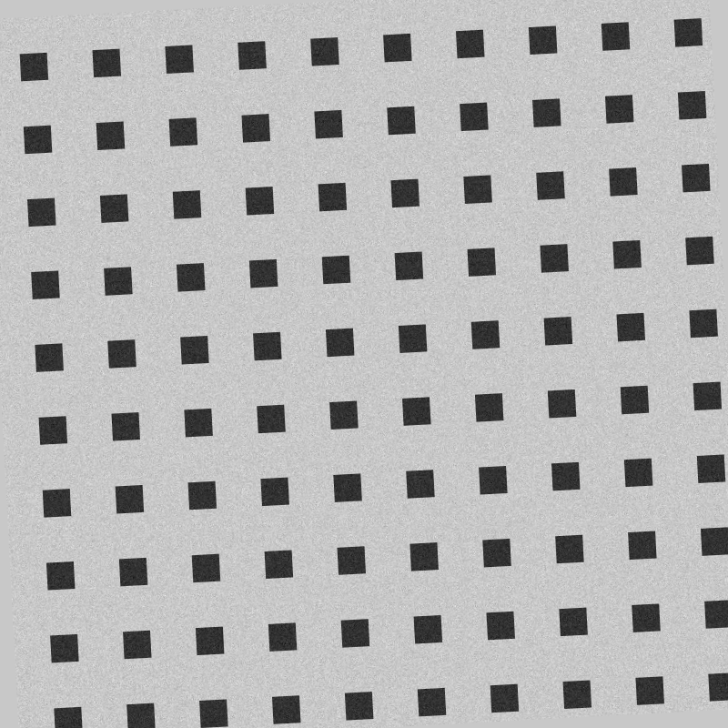
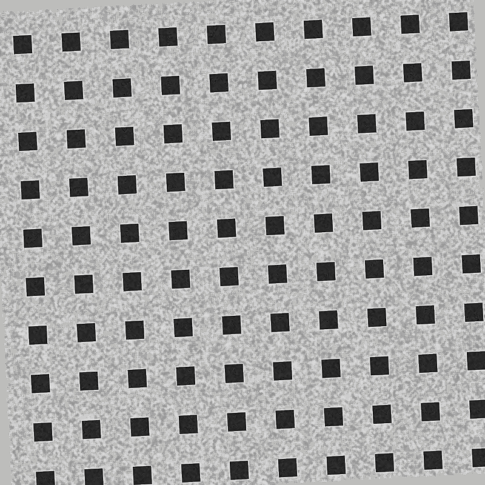
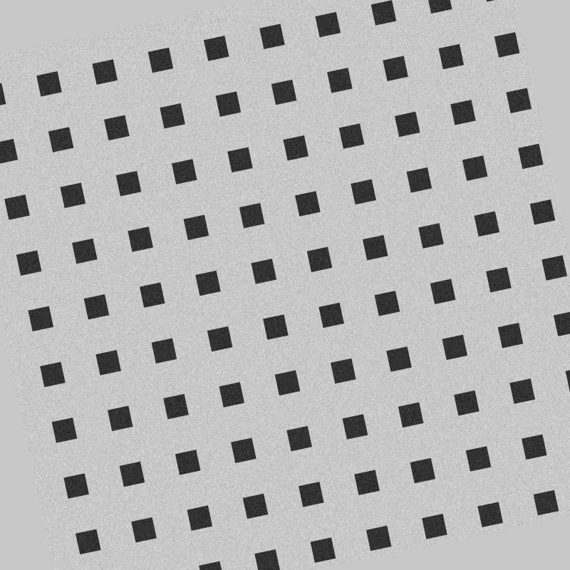
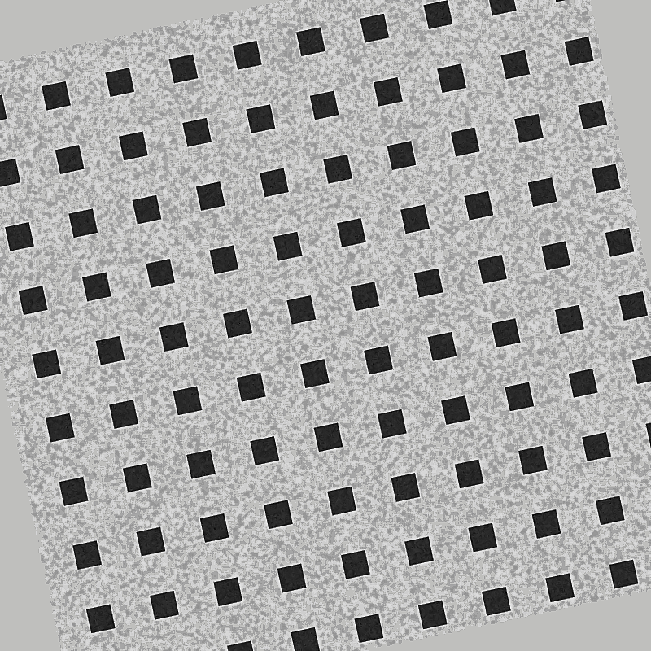
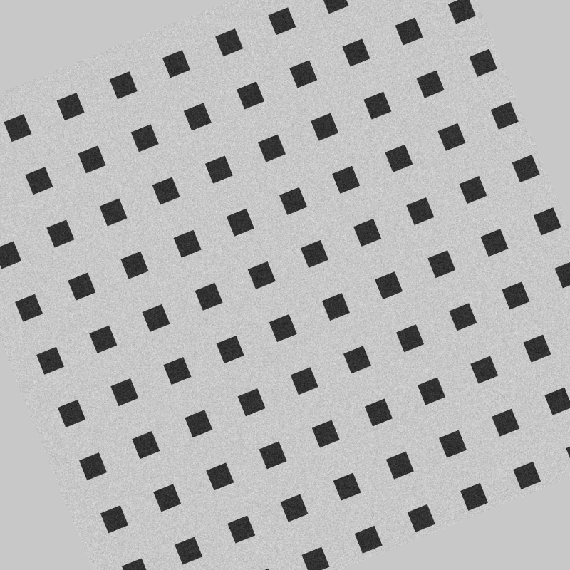
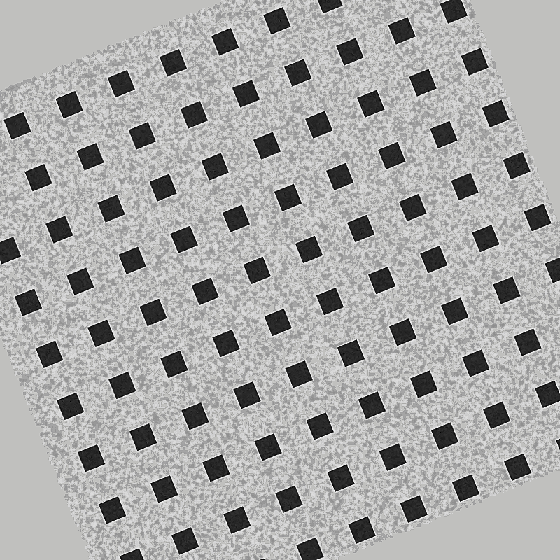

# OpenCV Pre-Processing A/B Test (ISSUE 4.1)

**FedRAMP Control:** SI-10 (Information Input Validation)

## Methodology

This repo has no real-world label photos to test against, so this report uses 20 synthetic "label photo" samples generated by [`backend/scripts/preprocessing_ab_test.py`](../../backend/scripts/preprocessing_ab_test.py): a checkerboard pattern (simulating printed text on a label) rotated by a skew angle (3°–22°, evenly spaced across the 20 samples) with Gaussian noise added (σ=10), approximating the skew + noise + reduced-contrast profile of a typical phone photo.

For each sample, [`ocr.quality.assess_image_quality`](../../backend/ocr/quality.py) scores the image 0-100 before and after [`ocr.preprocessor.preprocess_image`](../../backend/ocr/preprocessor.py) (deskew -> denoise -> sharpen -> contrast, via OpenCV's `getRotationMatrix2D`, `fastNlMeansDenoisingColored`, and `equalizeHist`). The same scenario runs as a fast regression check in [`backend/tests/test_preprocessor.py::test_preprocessing_improves_quality_score_on_degraded_images`](../../backend/tests/test_preprocessor.py).

To regenerate this report and the sample images:

```
cd backend
python scripts/preprocessing_ab_test.py
```

## Summary

| Metric | Value |
|---|---|
| Samples | 20 |
| Average score before | 88.0 |
| Average score after | 100.0 |
| Average improvement (Δ score) | +12.0 |
| Samples improved (Δ score > 0) | 16 / 20 |
| Average pre-processing time | 0.267s |
| Max pre-processing time | 0.424s (budget: ≤ 0.5s, ISSUE 4.1 AC) |

(Timings exclude one untimed warm-up call that absorbs OpenCV's one-time thread-pool/SIMD-dispatch initialization -- a cost a long-running API server pays once at startup, not per image.)

## Showcase

Before/after images for a low-skew, median-skew, and high-skew sample (full results for all 20 samples below).

### Sample 1 — skew 3.0°

| Before | After |
|---|---|
|  |  |
| Score 85.0 — skewed_angle | Score 100.0 — none |

### Sample 10 — skew 12.0°

| Before | After |
|---|---|
|  |  |
| Score 100.0 — none | Score 100.0 — none |

### Sample 20 — skew 22.0°

| Before | After |
|---|---|
|  |  |
| Score 85.0 — skewed_angle | Score 100.0 — none |

## Full Results

| Sample | Skew angle | Score before | Issues before | Score after | Issues after | Δ score | Time (s) |
|---|---|---|---|---|---|---|---|
| 1 | 3.0° | 85.0 | skewed_angle | 100.0 | none | +15.0 | 0.251 |
| 2 | 4.0° | 85.0 | skewed_angle | 100.0 | none | +15.0 | 0.198 |
| 3 | 5.0° | 100.0 | none | 100.0 | none | +0.0 | 0.216 |
| 4 | 6.0° | 85.0 | skewed_angle | 100.0 | none | +15.0 | 0.234 |
| 5 | 7.0° | 85.0 | skewed_angle | 100.0 | none | +15.0 | 0.424 |
| 6 | 8.0° | 85.0 | skewed_angle | 100.0 | none | +15.0 | 0.376 |
| 7 | 9.0° | 85.0 | skewed_angle | 100.0 | none | +15.0 | 0.197 |
| 8 | 10.0° | 85.0 | skewed_angle | 100.0 | none | +15.0 | 0.230 |
| 9 | 11.0° | 85.0 | skewed_angle | 100.0 | none | +15.0 | 0.252 |
| 10 | 12.0° | 100.0 | none | 100.0 | none | +0.0 | 0.312 |
| 11 | 13.0° | 100.0 | none | 100.0 | none | +0.0 | 0.351 |
| 12 | 14.0° | 85.0 | skewed_angle | 100.0 | none | +15.0 | 0.193 |
| 13 | 15.0° | 85.0 | skewed_angle | 100.0 | none | +15.0 | 0.240 |
| 14 | 16.0° | 85.0 | skewed_angle | 100.0 | none | +15.0 | 0.262 |
| 15 | 17.0° | 85.0 | skewed_angle | 100.0 | none | +15.0 | 0.292 |
| 16 | 18.0° | 85.0 | skewed_angle | 100.0 | none | +15.0 | 0.285 |
| 17 | 19.0° | 100.0 | none | 100.0 | none | +0.0 | 0.238 |
| 18 | 20.0° | 85.0 | skewed_angle | 100.0 | none | +15.0 | 0.248 |
| 19 | 21.0° | 85.0 | skewed_angle | 100.0 | none | +15.0 | 0.277 |
| 20 | 22.0° | 85.0 | skewed_angle | 100.0 | none | +15.0 | 0.270 |
