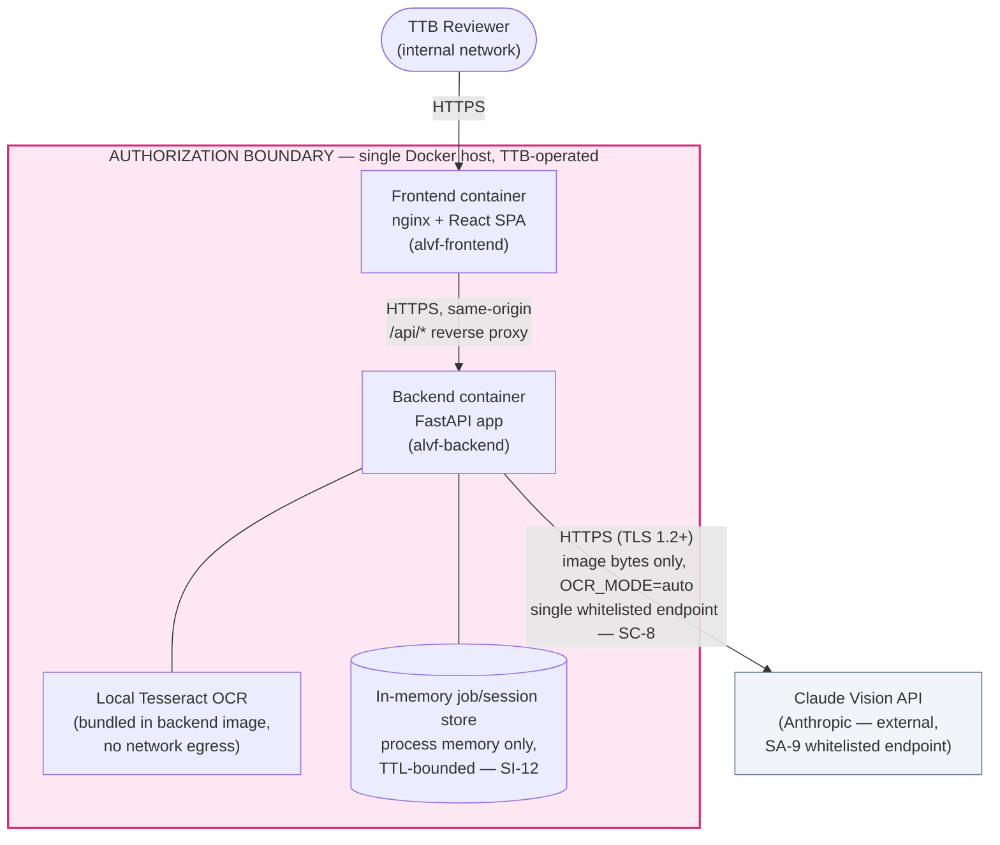

# System Security Plan (Draft) — Alcohol Label Verification PoC

| | |
|---|---|
| **System Name** | Alcohol Label Verification App (ALVA) — TTB COLA Automation PoC |
| **Document Status** | **DRAFT** — Phase 1 (started alongside the architecture, per PL-2) |
| **Version** | 0.1 (draft) |
| **Date** | 2026-06-10 |
| **Issue** | [ISSUE 1.6 — Draft System Security Plan (SSP)](../../project-management/PROJECT-PLAN.md) |
| **Template Basis** | NIST SP 800-18 / FedRAMP SSP outline, mapped to NIST SP 800-53 Rev. 5 controls |
| **Target Baseline** | FedRAMP **Moderate** |
| **Successor Document** | [`SSP-final.md`](./SSP-final.md) (ISSUE 4.5 — Complete FedRAMP Documentation Package) |

> **Scope note.** This is a **draft** SSP, written while the system is being built (PL-2 requires
> security planning to start in Phase 1, not be retrofitted). It documents the architecture,
> data, and controls **as implemented through Phase 2** (issues 1.1–2.7) and explicitly flags
> items that are **planned** for Phase 3/4. `SSP-final.md` (ISSUE 4.5) will update every
> "Planned" row below to "Implemented" (or move it to `POAM.md` if it remains a gap), add the
> finalized [`DATA-FLOW-final.md`](./DATA-FLOW-final.md), and route the document for ISSO
> review. Full ATO is out of scope for this PoC — the deliverable is an assessment-ready
> documentation package.

---

## 1. Information System Name and Identifier

- **Name:** Alcohol Label Verification App (ALVA)
- **Acronym:** ALVA
- **Sponsoring Agency:** Department of the Treasury — Alcohol and Tobacco Tax and Trade Bureau (TTB)
- **Repository:** `alcohol-label-verification-app` (monorepo: `/frontend`, `/backend`, `/docker`, `/docs`)
- **Information System Type:** **Minor Application**, intended to run on infrastructure provided
  by an existing TTB/Treasury General Support System (GSS). ALVA does not provision its own
  network perimeter, physical hosting, or identity provider — those controls are **inherited**
  from the hosting GSS. This SSP documents the **system-specific** controls implemented in the
  application and its containers.

---

## 2. System Categorization (FIPS 199)

Per FIPS 199 / NIST SP 800-60, the system processes business-sensitive COLA (Certificate of
Label Approval) application data, including data classified as PII (§7), and produces match
results that feed a regulatory review process.

| Security Objective | Impact Level | Justification |
|---|---|---|
| **Confidentiality** | **Moderate** | The system handles label images and COLA application metadata, including the bottler/importer **Name & Address** field, which is classified as PII for this system (§7). Unauthorized disclosure would be a business-sensitive/PII exposure with serious — but not catastrophic — effect on individuals and the agency. |
| **Integrity** | **Moderate** | Match results (field-by-field comparison, Government Warning validation) inform a human reviewer's COLA approval/rejection decision. Undetected modification of OCR output or match scores could lead to an incorrect approval recommendation. A human reviewer remains in the loop for every decision (the PoC does not auto-approve), which bounds — but does not eliminate — the impact, hence Moderate rather than High. |
| **Availability** | **Moderate** | ALVA accelerates a manual review workflow used for ~150,000 applications/year. An outage delays throughput and forces reviewers back to a fully manual process; it is not life-safety-critical, but a sustained outage has a serious effect on agency operations at this volume. |
| **System Categorization** | **Moderate** (high-water mark of C, I, A) | Drives selection of the **FedRAMP Moderate** control baseline (NIST SP 800-53 Rev. 5). |

---

## 3. General System Description and Purpose

ALVA automates the routine **label-vs-application verification** step of the COLA review
process: a reviewer uploads a photo/scan of a physical alcohol label and the corresponding
application data, and the system extracts the label's text fields (via OCR/vision), compares
them to the submitted application data (fuzzy matching for most fields, exact word-for-word
matching for the Government Warning), and returns a field-by-field match report for the
reviewer to confirm.

The system is a **containerized, single-node web application**:

- **Frontend** — React SPA served by nginx, reverse-proxying `/api/*` to the backend (same-origin, no CORS).
- **Backend** — Python FastAPI service exposing `/health`, `/verify`, `/verify/batch`, and `/jobs/*`.
- **OCR/Vision** — local Tesseract (always available) with an optional Claude Vision API call
  (single whitelisted external endpoint) for higher accuracy when network egress is permitted.
- **Matching** — RapidFuzz-based fuzzy matching plus an exact-match validator for the Government
  Warning text.
- **Storage** — none. All processing is in-memory for the lifetime of a request or a
  TTL-bounded batch session; nothing is written to disk inside the containers.

For the full architecture decision record, component diagram, and sequence diagrams, see
[ADR-001: System Architecture](../architecture/ADR-001-System-Architecture.md).

---

## 4. Authorization Boundary

The diagram below shows the **authorization boundary** for ALVA — the set of components this
SSP covers — and the single point where data crosses that boundary. It is a boundary-focused
view of the architecture documented in detail in
[ADR-001](../architecture/ADR-001-System-Architecture.md#system-architecture-diagram)
(component diagram, sequence diagrams, data flow diagram).

**Reading the diagram:**

- Everything inside the pink box — the frontend container, backend container, bundled
  Tesseract binary, and the in-memory store — is **inside the authorization boundary** and runs
  on a single TTB-operated Docker host.
- The **only** connection that crosses the boundary is the optional call from the backend to
  the **Claude Vision API**, made only when `OCR_MODE=auto` (or `cloud`) and an
  `ANTHROPIC_API_KEY` is configured. When `OCR_MODE=local` (air-gapped operation), **no**
  connection crosses the boundary — Tesseract handles all OCR locally.
- Network perimeter controls (firewall, ingress TLS termination, DNS) and physical hosting are
  **inherited** from the TTB/Treasury hosting GSS and are out of scope for this application-level
  SSP; they are referenced here for completeness and will be confirmed with the hosting GSS's
  SSP during ISSO review.

---

## 5. Data Types Inventory

| Data Type | Description | Sensitivity | Contains PII? | Persistence | Flow |
|---|---|---|---|---|---|
| **Label image** | Photo/scan of a physical alcohol label (JPEG/PNG/GIF/BMP/TIFF/WEBP, ≤ `MAX_IMAGE_MB` = 20 MB by default) | Business-sensitive | Possibly (the printed label may show a Name & Address) | In-memory for the duration of one `/verify` request, or one batch job (TTL-bounded). Never written to disk. | Reviewer upload → `decode_base64_image`/`validate_image_bytes` → OCR adapter → (optional, if `OCR_MODE` permits) Claude Vision API |
| **Application (COLA) metadata** | The 7 TTB-required label fields submitted with the application: brand, class/type, ABV, net contents, **Name & Address**, country of origin, Government Warning text | Business-sensitive | **Yes** — Name & Address (§7) | In-memory only, part of the request/response payload and the TTL-bounded job store | Reviewer input → `POST /verify` / `POST /verify/batch` (`ApplicationData` model) |
| **Extracted fields** | OCR/Vision output for the same 7 fields, plus `confidence_score` and `ocr_engine_used` | Business-sensitive | **Yes** — `name_address` | In-memory only | OCR adapter (`backend/ocr/adapter.py`) → matching engine |
| **Match results** | Per-field `FieldComparison` (status, score), `GovernmentWarningCheck`, `overall_status`, image quality score | Business-sensitive | Indirect — field comparisons reference `name_address` extracted/expected values | In-memory job store (`backend/app/jobstore.py`), bounded by `SESSION_TTL_HOURS` (default 4h, ISSUE 3.5); exportable as CSV by the reviewer (`/jobs/{id}/export`) | Matching engine (`backend/matching/`) → `/jobs/{id}/status\|results\|export` |
| **Audit/operational logs** | Structured JSON events: `timestamp`, `request_id`, `endpoint`, `method`, `status_code`, `duration_ms`, `session_id`, `ocr_engine_used`, `overall_status`, `confidence_score`, error `error`/`message` | Low — **no PII by design** | No (see §6) | Written to **stdout only**; retained per the hosting platform's container log driver (AU-9) | All endpoints (`backend/app/audit.py`, ISSUE 2.7) |

A finalized end-to-end data flow diagram (with confirmed encryption posture and endpoint URLs)
will be delivered as `DATA-FLOW.md` → `DATA-FLOW-final.md` (ISSUE 1.7 / 4.5).

---

## 6. PII Handling

- **What is PII in this system:** the **Name & Address** field — the bottler/importer's name
  and mailing address, submitted on the COLA application and printed on the label — is
  classified as **PII** for ALVA, because for sole-proprietor producers it can identify a
  specific individual. It appears in three places: `ApplicationData.name_address`,
  `ExtractedFields.name_address`, and the corresponding `FieldComparison` (`field="name_address"`)
  in match results.

- **Ephemeral handling (no persistence):**
  - The application performs **no disk writes** of request payloads, label images, or
    extracted/match data anywhere in `backend/app` or `backend/ocr`.
  - `/verify` (single label) holds data only for the lifetime of that HTTP request.
  - `/verify/batch` results are held in the in-memory `jobstore` (`backend/app/jobstore.py`)
    until the reviewer retrieves/exports them or the session TTL (`SESSION_TTL_HOURS`, default
    4 hours) expires (TTL **enforcement** lands in ISSUE 3.5 — see §8, SI-12).
  - There is no database, no object storage, and no third-party analytics/telemetry.

- **Audit logs never contain PII (AU-9):** the structured audit logging module
  (`backend/app/audit.py`, ISSUE 2.7) exposes one helper function per event type, each with an
  explicit keyword-only signature (`request_id`, `session_id`, `endpoint`, `status_code`,
  `duration_ms`, `ocr_engine_used`, `overall_status`, `confidence_score`, `error`, `message`).
  None of these signatures accept raw image bytes, base64 payloads, or the `name_address` value
  — it is **structurally impossible** for application code to log them. This is verified by
  `backend/tests/test_audit_logging.py::test_logs_never_contain_pii`, which asserts the literal
  `name_address` string and the base64 image payload never appear in captured log output.

- **External transmission of PII:** when `OCR_MODE` permits a Claude Vision call, the label
  image (which may visually contain the Name & Address) is sent over TLS to the single
  whitelisted Anthropic API endpoint for inference only, with `max_retries=0` and a bounded
  timeout (`OCR_API_TIMEOUT_SECONDS`). Per Anthropic's API terms, data submitted via the API is
  not used to train models; the ISSO should confirm the agency's Data Processing Agreement /
  ATO conditions with Anthropic before this path is enabled in any environment that is not
  air-gapped (`OCR_MODE=local` removes this transmission entirely).

---

## 7. System Interconnections

| Interconnection | Direction | Protocol | Purpose | Data Exchanged | Status |
|---|---|---|---|---|---|
| **Claude Vision API** (`api.anthropic.com`) | Outbound, backend → external | HTTPS (TLS 1.2+), via the `anthropic` Python SDK | Primary OCR/vision extraction for higher accuracy | Label image bytes (base64) + extraction prompt → structured field JSON response. No persistent connection; one request per label. | **Conditional** — only when `OCR_MODE=auto`/`cloud` **and** `ANTHROPIC_API_KEY` is set. Single whitelisted endpoint (SA-9). Network failure (`APITimeoutError`/`APIConnectionError`/`TimeoutError`/`ConnectionError`) fails over immediately to local Tesseract — no retries. |
| **Local Tesseract OCR** | In-process / local binary | N/A (no network) | Fallback (or sole, when `OCR_MODE=local`) OCR extraction in air-gapped environments | Label image bytes → raw OCR text → parsed fields | **Always available** — bundled in the backend container image (`docker/backend.Dockerfile`). |
| Database / object storage | — | — | — | — | **None.** No external data store of any kind. |
| Reviewer ↔ Frontend | Inbound | HTTPS | Web UI | Label images, application data, results | Ingress TLS termination is provided by the hosting GSS (inherited control, AC-17/SC-8). |
| Frontend ↔ Backend | Internal | HTTPS via nginx reverse proxy, same-origin `/api/*` | API calls | Same payloads as above | No CORS exposure — same-origin only (`docker/frontend.Dockerfile`, nginx config). |

No other external systems, APIs, or services are integrated. The legacy .NET COLA system is
explicitly **not** integrated in this PoC (per ADR-001 constraints).

---

## 8. Minimum Security Controls — Implementation Summary

The table below maps the control families called out in ISSUE 1.6 (**AC, AU, CM, IA, SC, SI**)
to their implementation status as of this draft. It is a subset of the full
[FedRAMP Control Coverage Matrix](../../project-management/PROJECT-PLAN.md#fedramp-control-coverage-matrix)
in the project plan; `SSP-final.md` (ISSUE 4.5) will carry the complete matrix plus any
remaining gaps in `POAM.md`.

### AC — Access Control

| Control | Name | Status | Implementation Notes |
|---|---|---|---|
| AC-3 | Access Enforcement | **Planned** (Phase 3, ISSUE 3.7) | Session-token authentication and per-session results isolation are not yet implemented. Currently there is no authentication layer — tracked as a gap for `POAM.md`. |
| AC-4 | Information Flow Enforcement | **Implemented** | All processing is in-memory within the authorization boundary (§4); the only cross-boundary flow is the single whitelisted Claude Vision endpoint (§7), gated by `OCR_MODE`. |
| AC-17 | Remote Access | **Implemented / Inherited** | The frontend is reachable only over HTTPS; `/api/*` is same-origin via the nginx reverse proxy (no CORS). TLS termination at the network ingress is inherited from the hosting GSS. |

### AU — Audit and Accountability

| Control | Name | Status | Implementation Notes |
|---|---|---|---|
| AU-2 | Event Logging | **Implemented** (ISSUE 2.7) | `backend/app/audit.py` configures `structlog` to emit one JSON object per line. Logged events: `request_received`, `request_completed`, `ocr_started`, `ocr_completed`, `match_completed`, `request_error`, and `session_expired` (helper ready for ISSUE 3.5). |
| AU-3 | Content of Audit Records | **Implemented** | `request_completed` records `timestamp`, `request_id`, `endpoint`, `method`, `status_code`, `duration_ms`, `session_id`, and `ocr_engine_used`. `request_error` records `status_code`, `error`, and `message`. |
| AU-9 | Protection of Audit Information | **Implemented** | Logs go to **stdout only** (`structlog.PrintLoggerFactory`) — never to a file inside the container — so the platform's log collector owns retention/rotation. Helper-function signatures structurally exclude PII (§6). |

### CM — Configuration Management

| Control | Name | Status | Implementation Notes |
|---|---|---|---|
| CM-2 | Baseline Configuration | **Implemented** | All runtime dependencies are pinned (`backend/requirements.txt`, `frontend/package.json` + lockfile); base images are digest-pinned (`docker/backend.Dockerfile`, `docker/frontend.Dockerfile`). |
| CM-3 | Configuration Change Control | **Implemented** | GitHub branch protection on `main` requires the aggregate `CI Success` status check; all changes land via reviewed PRs (`CODEOWNERS`). |
| CM-6 | Configuration Settings | **Implemented** | All tunables are environment variables documented in `.env.example` (`LOG_LEVEL`, `OCR_MODE`, `CLAUDE_VISION_MODEL`, `OCR_API_TIMEOUT_SECONDS`, `MAX_IMAGE_MB`, `SESSION_TTL_HOURS`, `VITE_API_URL`, etc.) — no hardcoded configuration or secrets. |
| CM-7 | Least Functionality | **Implemented** | Backend container runs as an unprivileged `app` user (`docker/backend.Dockerfile`); both images are based on `-slim`/`-alpine` variants with minimal installed packages. |

### IA — Identification and Authentication

| Control | Name | Status | Implementation Notes |
|---|---|---|---|
| IA-2 | Identification and Authentication | **Planned** (Phase 3, ISSUE 3.7) | The PoC currently has no user identity or authentication layer; session-token authentication is scoped for ISSUE 3.7. Tracked as a gap for `POAM.md` until then. |

### SC — System and Communications Protection

| Control | Name | Status | Implementation Notes |
|---|---|---|---|
| SC-8 | Transmission Confidentiality and Integrity | **Implemented** | The `anthropic` SDK uses HTTPS (TLS 1.2+) for the Claude Vision call (§7); reviewer-facing HTTPS and ingress TLS termination are inherited from the hosting GSS. |
| SC-23 | Session Authenticity | **Planned** (Phase 3, ISSUE 3.7) | HttpOnly/Secure/SameSite session cookies are scoped for ISSUE 3.7, alongside IA-2. |
| SC-28 | Protection of Information at Rest | **Implemented** | No disk writes of label images, application data, extracted fields, or match results anywhere in `backend/app`/`backend/ocr`/`backend/matching` — confirmed by code review; all state lives in `backend/app/jobstore.py`'s in-memory dict. |

### SI — System and Information Integrity

| Control | Name | Status | Implementation Notes |
|---|---|---|---|
| SI-3 | Malicious Code Protection | **Implemented** (ISSUE 2.6) | Bandit (Python SAST) and Trivy (container image scanning, CRITICAL gate) run on every PR; results in `docs/fedramp/SAST-RESULTS.md`. |
| SI-7 | Software, Firmware, and Information Integrity | **Implemented** (ISSUE 2.5) | `backend/matching/exact_validator.py` performs a word-for-word, ALL-CAPS-prefix exact match of the Government Warning text against the application data. |
| SI-10 | Information Input Validation | **Implemented** (ISSUE 3.6) | All API I/O is typed via Pydantic models (`backend/app/models.py` — no untyped dicts cross the API boundary, `ApplicationData` strips whitespace via `str_strip_whitespace=True` and enforces per-field `max_length`); both `/verify` and `/verify/batch` validate every image by magic-byte signature and size, not declared Content-Type (`backend/app/validation.py`, HTTP 413/415); `application_csv` rejects missing or unrecognized column names (`backend/batch/csv_input.py`, HTTP 422); a 20+ case fuzz suite (`backend/tests/test_input_validation.py`) confirms malformed input never produces a 5xx. |
| SI-11 | Error Handling | **Implemented** | A uniform `ErrorResponse{error, message, request_id}` envelope is returned for all HTTP and validation errors (`backend/app/main.py`), and every error response also emits a `request_error` audit event (§AU-3). |
| SI-12 | Information Management and Retention | **Planned** (Phase 3, ISSUE 3.5) | `SESSION_TTL_HOURS` (default 4h) is already a defined configuration setting (`.env.example`, `docker-compose.yml`) and `audit.log_session_expired()` is implemented and tested; the TTL **reaper** that calls it from `jobstore` is scoped for ISSUE 3.5. |
| SI-16 | Memory Protection | **Implemented** (ISSUE 3.6) | Per-image (`MAX_IMAGE_MB`, default 20MB) and per-batch (`MAX_BATCH_MB`, default 500MB) size limits are enforced before any image is processed (`backend/app/validation.py`, HTTP 413), bounding worker memory regardless of client-supplied input. |

---

## 9. Applicable Laws, Regulations, and Standards

- Federal Information Security Modernization Act (FISMA)
- FedRAMP Moderate baseline, NIST SP 800-53 Revision 5
- NIST SP 800-18, *Guide for Developing Security Plans for Federal Information Systems*
- NIST SP 800-60, *Guide for Mapping Types of Information and Information Systems to Security Categories*
- FIPS Publication 199, *Standards for Security Categorization of Federal Information and Information Systems*
- FIPS Publication 200, *Minimum Security Requirements for Federal Information and Information Systems*

---

## 10. Roles and Responsibilities

| Role | Assignment |
|---|---|
| System Owner | TTB ALVA Program (assigned during formal ATO intake) |
| Information System Security Officer (ISSO) | TBD — assigned by TTB at hand-off |
| Authorizing Official (AO) | TBD — assigned by TTB at hand-off |
| Development Team | hfenelsoftllc and contributors (this repository) |

These assignments are placeholders for the agency to complete during formal ATO intake; they do
not block this draft, which is an engineering-authored artifact prepared for ISSO review.

---

## 11. Status and Next Steps

This draft will be carried forward and finalized as `SSP-final.md` in **ISSUE 4.5 — Complete
FedRAMP Documentation Package** (Phase 4), alongside:

- `POAM.md` — formalizing the **Planned** rows in §8 (AC-3/IA-2/SC-23 from ISSUE 3.7, SI-12 from
  ISSUE 3.5) as tracked gaps with remediation timelines, per CA-5.
- `DATA-FLOW-final.md` — the finalized data flow diagram with confirmed endpoint URLs and
  encryption posture (ISSUE 1.7 → 4.5).
- `THREAT-MODEL.md` (ISSUE 4.6) and `INCIDENT-RESPONSE-PLAN.md` (ISSUE 4.5), supporting RA-3 and
  IR-8 respectively.
- Peer review by a team member not involved in implementation, and routing to the assigned ISSO.
