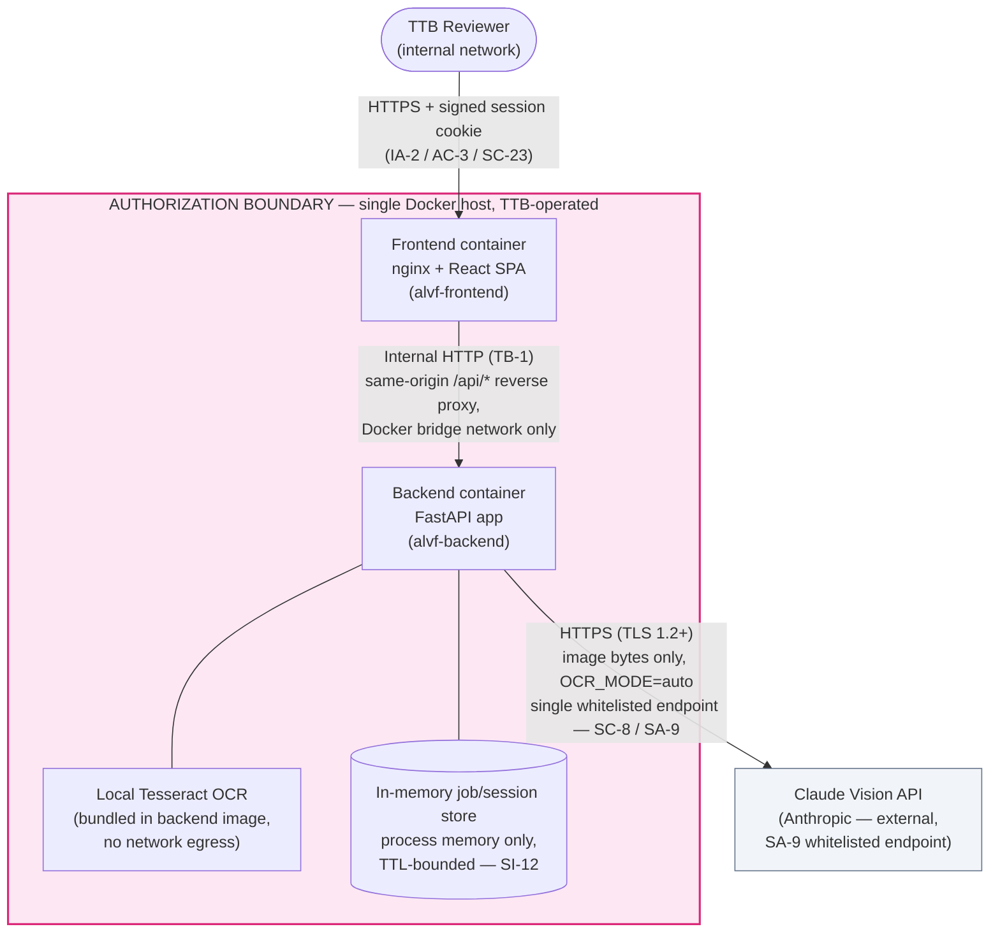

# System Security Plan — Alcohol Label Verification PoC

| | |
|---|---|
| **System Name** | Alcohol Label Verification App (ALVA) — TTB COLA Automation PoC |
| **Document Status** | **FINAL** — Phase 4 (ISSUE 4.5, complete FedRAMP documentation package; updated by ISSUE 4.6, Threat Model, and ISSUE 4.7, Final README & Deployment Guide) |
| **Version** | 1.2 |
| **Date** | 2026-06-12 |
| **Issue** | [ISSUE 4.5 — Complete FedRAMP Documentation Package](../../project-management/PROJECT-PLAN.md), [ISSUE 4.6 — Threat Model Documentation](https://github.com/hfenelsoftllc/alcohol-label-verification-app/issues/48), [ISSUE 4.7 — Final README & Deployment Guide](https://github.com/hfenelsoftllc/alcohol-label-verification-app/issues/49) |
| **Template Basis** | NIST SP 800-18 / FedRAMP SSP outline, mapped to NIST SP 800-53 Rev. 5 controls |
| **Target Baseline** | FedRAMP **Moderate** |
| **Predecessor Document** | [`SSP-draft.md`](./SSP-draft.md) (ISSUE 1.6 — Draft SSP, Phase 1) |

> **Scope note.** This is the **final** SSP for the ALVA PoC, superseding `SSP-draft.md`. It
> documents the architecture, data, and controls **as implemented through Phase 4** (issues
> 1.1–4.6) and carries the complete
> [FedRAMP Control Coverage Matrix](../../project-management/PROJECT-PLAN.md#fedramp-control-coverage-matrix)
> (§8, plus the color-coded [`CONTROL-MATRIX.xlsx`](./CONTROL-MATRIX.xlsx)). All 33 tracked
> controls are now **Implemented** — **RA-3** (Risk Assessment / Threat Model) was the final
> open item and is closed by [`THREAT-MODEL.md`](./THREAT-MODEL.md) (ISSUE 4.6), tracked to
> closure in [`POAM.md`](./POAM.md). Full ATO is out of scope for this PoC; this document,
> together with [`POAM.md`](./POAM.md), [`DATA-FLOW-final.md`](./DATA-FLOW-final.md),
> [`SAST-RESULTS.md`](./SAST-RESULTS.md), [`CONTROL-MATRIX.xlsx`](./CONTROL-MATRIX.xlsx),
> [`INCIDENT-RESPONSE-PLAN.md`](./INCIDENT-RESPONSE-PLAN.md),
> [`SYSTEM-BOUNDARY.png`](./SYSTEM-BOUNDARY.png), [`PEER-REVIEW.md`](./PEER-REVIEW.md),
> [`THREAT-MODEL.md`](./THREAT-MODEL.md), and the root
> [`README.md`](../../README.md) / [`DEPLOYMENT-GUIDE.md`](../DEPLOYMENT-GUIDE.md) (ISSUE 4.7)
> forms the assessment-ready documentation package handed off to the TTB ISSO (§11).

---

## 1. Information System Name and Identifier

- **Name:** Alcohol Label Verification App (ALVA)
- **Acronym:** ALVA
- **Sponsoring Agency:** Department of the Treasury — Alcohol and Tobacco Tax and Trade Bureau (TTB)
- **Repository:** `alcohol-label-verification-app` (monorepo: `/frontend`, `/backend`, `/docker`, `/docs`)
- **Information System Type:** **Minor Application**, intended to run on infrastructure provided
  by an existing TTB/Treasury General Support System (GSS). ALVA does not provision its own
  network perimeter, physical hosting, or identity provider — those controls are **inherited**
  from the hosting GSS. This SSP documents the **system-specific** controls implemented in the
  application and its containers.

---

## 2. System Categorization (FIPS 199)

Per FIPS 199 / NIST SP 800-60, the system processes business-sensitive COLA (Certificate of
Label Approval) application data, including data classified as PII (§7), and produces match
results that feed a regulatory review process.

| Security Objective | Impact Level | Justification |
|---|---|---|
| **Confidentiality** | **Moderate** | The system handles label images and COLA application metadata, including the bottler/importer **Name & Address** field, which is classified as PII for this system (§7). Unauthorized disclosure would be a business-sensitive/PII exposure with serious — but not catastrophic — effect on individuals and the agency. |
| **Integrity** | **Moderate** | Match results (field-by-field comparison, Government Warning validation) inform a human reviewer's COLA approval/rejection decision. Undetected modification of OCR output or match scores could lead to an incorrect approval recommendation. A human reviewer remains in the loop for every decision (the PoC does not auto-approve), which bounds — but does not eliminate — the impact, hence Moderate rather than High. |
| **Availability** | **Moderate** | ALVA accelerates a manual review workflow used for ~150,000 applications/year. An outage delays throughput and forces reviewers back to a fully manual process; it is not life-safety-critical, but a sustained outage has a serious effect on agency operations at this volume. |
| **System Categorization** | **Moderate** (high-water mark of C, I, A) | Drives selection of the **FedRAMP Moderate** control baseline (NIST SP 800-53 Rev. 5). |

---

## 3. General System Description and Purpose

ALVA automates the routine **label-vs-application verification** step of the COLA review
process: a reviewer uploads a photo/scan of a physical alcohol label and the corresponding
application data, and the system extracts the label's text fields (via OCR/vision), compares
them to the submitted application data (fuzzy matching for most fields, exact word-for-word
matching for the Government Warning), and returns a field-by-field match report for the
reviewer to confirm.

The system is a **containerized, single-node web application**:

- **Frontend** — React SPA served by nginx, reverse-proxying `/api/*` to the backend over the
  internal Docker bridge network (same-origin, no CORS).
- **Backend** — Python FastAPI service exposing `/health`, `/verify`, `/verify/batch`, and `/jobs/*`.
- **OCR/Vision** — local Tesseract (always available) with an optional Claude Vision API call
  (single whitelisted external endpoint) for higher accuracy when network egress is permitted.
- **Matching** — RapidFuzz-based fuzzy matching plus an exact-match validator for the Government
  Warning text.
- **Storage** — none. All processing is in-memory for the lifetime of a request or a
  TTL-bounded batch session; nothing is written to disk inside the containers.

For the full architecture decision record, component diagram, and sequence diagrams, see
[ADR-001: System Architecture](../architecture/ADR-001-System-Architecture.md). The finalized
authorization boundary diagram derived from ADR-001 is
[`SYSTEM-BOUNDARY.png`](./SYSTEM-BOUNDARY.png) (§4).

---

## 4. Authorization Boundary

The diagram below shows the **authorization boundary** for ALVA — the set of components this
SSP covers — and the points where data crosses that boundary. It is a boundary-focused view of
the architecture documented in detail in
[ADR-001](../architecture/ADR-001-System-Architecture.md#system-architecture-diagram)
(component diagram, sequence diagrams, data flow diagram). A pre-rendered PNG of this diagram
is published as [`SYSTEM-BOUNDARY.png`](./SYSTEM-BOUNDARY.png) (AC7, ISSUE 4.5).

**Reading the diagram:**

- Everything inside the pink box — the frontend container, backend container, bundled
  Tesseract binary, and the in-memory store — is **inside the authorization boundary** and runs
  on a single TTB-operated Docker host.
- **Frontend ↔ Backend (TB-1) is internal plain HTTP** over the Docker Compose bridge network
  (`proxy_pass http://backend:8000/`, same-origin `/api/*`) — it never leaves the authorization
  boundary, so SC-8's external-transmission requirement does not apply. See
  [`DATA-FLOW-final.md`](./DATA-FLOW-final.md) §3 and §6 for the full trust-boundary analysis.
- Every reviewer request carries a signed, HttpOnly, Secure, SameSite=Strict session cookie
  (IA-2 / AC-3 / SC-23, ISSUE 3.7), validated by backend middleware before any other processing.
  See [`SESSION-MANAGEMENT.md`](./SESSION-MANAGEMENT.md).
- The **only** connection that crosses the boundary to an external system is the optional call
  from the backend to the **Claude Vision API**, made only when `OCR_MODE` is set to a value
  other than `local` (e.g. `auto`) and an `ANTHROPIC_API_KEY` is configured. When
  `OCR_MODE=local` (air-gapped operation), **no** connection crosses the boundary — Tesseract
  handles all OCR locally.
- Network perimeter controls (firewall, ingress TLS termination, DNS) and physical hosting are
  **inherited** from the TTB/Treasury hosting GSS and are out of scope for this application-level
  SSP; they are referenced here for completeness and will be confirmed with the hosting GSS's
  SSP during ISSO review.

---

## 5. Data Types Inventory

| Data Type | Description | Sensitivity | Contains PII? | Persistence | Flow |
|---|---|---|---|---|---|
| **Label image** | Photo/scan of a physical alcohol label (JPEG/PNG/GIF/BMP/TIFF/WEBP, ≤ `MAX_IMAGE_MB` = 20 MB by default) | Business-sensitive | Possibly (the printed label may show a Name & Address) | In-memory for the duration of one `/verify` request, or one batch job (TTL-bounded). Never written to disk. | Reviewer upload → `decode_base64_image`/`validate_image_bytes` → OCR adapter → (optional, if `OCR_MODE` permits) Claude Vision API |
| **Application (COLA) metadata** | The 7 TTB-required label fields submitted with the application: brand, class/type, ABV, net contents, **Name & Address**, country of origin, Government Warning text | Business-sensitive | **Yes** — Name & Address (§7) | In-memory only, part of the request/response payload and the TTL-bounded job store | Reviewer input → `POST /verify` / `POST /verify/batch` (`ApplicationData` model) |
| **Extracted fields** | OCR/Vision output for the same 7 fields, plus `confidence_score` and `ocr_engine_used` | Business-sensitive | **Yes** — `name_address` | In-memory only | OCR adapter (`backend/ocr/adapter.py`) → matching engine |
| **Match results** | Per-field `FieldComparison` (status, score), `GovernmentWarningCheck`, `overall_status`, image quality score | Business-sensitive | Indirect — field comparisons reference `name_address` extracted/expected values | In-memory job store (`backend/batch/store.py`), bounded by `SESSION_TTL_HOURS` (default 4h, ISSUE 3.5, SI-12); exportable as CSV/XLSX by the reviewer (`/jobs/{id}/export`) | Matching engine (`backend/matching/`) → `/jobs/{id}/status\|results\|export` |
| **Audit/operational logs** | Structured JSON events: `timestamp`, `request_id`, `endpoint`, `method`, `status_code`, `duration_ms`, `session_id`, `ocr_engine_used`, `overall_status`, `confidence_score`, error `error`/`message` | Low — **no PII by design** | No (see §6) | Written to **stdout only**; retained per the hosting platform's container log driver (AU-9) | All endpoints (`backend/app/audit.py`, ISSUE 2.7) |

The finalized end-to-end data flow diagram, with confirmed endpoint URLs and encryption
posture, is [`DATA-FLOW-final.md`](./DATA-FLOW-final.md) (ISSUE 1.7 → 4.5).

---

## 6. PII Handling

- **What is PII in this system:** the **Name & Address** field — the bottler/importer's name
  and mailing address, submitted on the COLA application and printed on the label — is
  classified as **PII** for ALVA, because for sole-proprietor producers it can identify a
  specific individual. It appears in three places: `ApplicationData.name_address`,
  `ExtractedFields.name_address`, and the corresponding `FieldComparison` (`field="name_address"`)
  in match results.

- **Ephemeral handling (no persistence):**
  - The application performs **no disk writes** of request payloads, label images, or
    extracted/match data anywhere in `backend/app` or `backend/ocr`.
  - `/verify` (single label) holds data only for the lifetime of that HTTP request.
  - `/verify/batch` results are held in the in-memory job store (`backend/batch/store.py`)
    until the reviewer retrieves/exports them or the session TTL (`SESSION_TTL_HOURS`, default
    4 hours) expires — **enforced** by `backend/batch/store.py::_reap_expired`, which drops
    idle jobs and emits a `session_expired` audit event (ISSUE 3.5, SI-12 — see §8).
  - There is no database, no object storage, and no third-party analytics/telemetry.

- **Audit logs never contain PII (AU-9):** the structured audit logging module
  (`backend/app/audit.py`, ISSUE 2.7) exposes one helper function per event type, each with an
  explicit keyword-only signature (`request_id`, `session_id`, `endpoint`, `status_code`,
  `duration_ms`, `ocr_engine_used`, `overall_status`, `confidence_score`, `error`, `message`).
  None of these signatures accept raw image bytes, base64 payloads, or the `name_address` value
  — it is **structurally impossible** for application code to log them. This is verified by
  `backend/tests/test_audit_logging.py::test_logs_never_contain_pii`, which asserts the literal
  `name_address` string and the base64 image payload never appear in captured log output.

- **External transmission of PII:** when `OCR_MODE` permits a Claude Vision call, the label
  image (which may visually contain the Name & Address) is sent over TLS to the single
  whitelisted Anthropic API endpoint for inference only, with `max_retries=0` and a bounded
  timeout (`OCR_API_TIMEOUT_SECONDS`). Per Anthropic's API terms, data submitted via the API is
  not used to train models; the ISSO should confirm the agency's Data Processing Agreement /
  ATO conditions with Anthropic before this path is enabled in any environment that is not
  air-gapped (`OCR_MODE=local` removes this transmission entirely).

---

## 7. System Interconnections

| Interconnection | Direction | Protocol | Purpose | Data Exchanged | Status |
|---|---|---|---|---|---|
| **Claude Vision API** (`api.anthropic.com`) | Outbound, backend → external | HTTPS (TLS 1.2+), via the `anthropic` Python SDK | Primary OCR/vision extraction for higher accuracy | Label image bytes (base64) + extraction prompt → structured field JSON response. No persistent connection; one request per label. | **Conditional** — only when `OCR_MODE` is not `local` (e.g. `auto`) **and** `ANTHROPIC_API_KEY` is set. Single whitelisted endpoint (SA-9). Network or rate-limit failure (`APITimeoutError`/`APIConnectionError`/`RateLimitError`/`TimeoutError`/`ConnectionError`) fails over immediately to local Tesseract — no retries. |
| **Local Tesseract OCR** | In-process / local binary | N/A (no network) | Fallback (or sole, when `OCR_MODE=local`) OCR extraction in air-gapped environments | Label image bytes → raw OCR text → parsed fields | **Always available** — bundled in the backend container image (`docker/backend.Dockerfile`). |
| Database / object storage | — | — | — | — | **None.** No external data store of any kind. |
| Reviewer ↔ Frontend | Inbound | HTTPS (TB-0) | Web UI | Label images, application data, results, signed session cookie | Ingress TLS termination is provided by the hosting GSS (inherited control, AC-17/SC-8). |
| Frontend ↔ Backend | Internal (TB-1) | **Internal HTTP** (not TLS) via nginx reverse proxy, same-origin `/api/*`, Docker Compose bridge network | API calls | Same payloads as above | No CORS exposure — same-origin only (`docker/frontend.Dockerfile`, nginx config). Internal-only traffic; SC-8's external-transmission requirement does not apply (see [`DATA-FLOW-final.md`](./DATA-FLOW-final.md) §6). |

No other external systems, APIs, or services are integrated. The legacy .NET COLA system is
explicitly **not** integrated in this PoC (per ADR-001 constraints).

The optional `docker-compose.yml` `with-redis` profile (`docker compose --profile with-redis
up`) provisions a `redis:7-alpine` container and sets `REDIS_URL` in the backend environment;
as of this release no backend code reads `REDIS_URL` or connects to Redis, so enabling this
profile introduces **no** additional interconnection, data flow, or attack surface. It is
reserved for a future shared job-store backend.

---

## 8. Minimum Security Controls — Implementation Summary

The table below maps every control family in the
[FedRAMP Control Coverage Matrix](../../project-management/PROJECT-PLAN.md#fedramp-control-coverage-matrix)
(**AC, AU, CA, CM, IA, IR, PL, RA, SA, SC, SI** — 29 controls), plus 4 PoC-specific additions
carried over from `SSP-draft.md` (**AU-14, SI-11, CP-10, PL-8**), to their final implementation
status. The same 33 controls, color-coded by status, are published as
[`CONTROL-MATRIX.xlsx`](./CONTROL-MATRIX.xlsx). All 33 controls are **Implemented**;
[`POAM.md`](./POAM.md) tracks no remaining control gaps (only a forward-looking scalability
item, T-D2, surfaced by [`THREAT-MODEL.md`](./THREAT-MODEL.md)).

### AC — Access Control

| Control | Name | Status | Implementation Notes |
|---|---|---|---|
| AC-3 | Access Enforcement | **Implemented** (ISSUE 3.7) | Every `/jobs/*` request requires a valid signed session cookie (403 otherwise); each batch job is scoped to the session that created it (404 for any other session). See [`SESSION-MANAGEMENT.md`](./SESSION-MANAGEMENT.md). |
| AC-4 | Information Flow Enforcement | **Implemented** | All processing is in-memory within the authorization boundary (§4); the only cross-boundary flow is the single whitelisted Claude Vision endpoint (§7), gated by `OCR_MODE`. |
| AC-17 | Remote Access | **Implemented / Inherited** | The frontend is reachable only over HTTPS; `/api/*` is same-origin via the nginx reverse proxy (no CORS). TLS termination at the network ingress is inherited from the hosting GSS. |

### AU — Audit and Accountability

| Control | Name | Status | Implementation Notes |
|---|---|---|---|
| AU-2 | Event Logging | **Implemented** (ISSUE 2.7) | `backend/app/audit.py` configures `structlog` to emit one JSON object per line. Logged events: `request_received`, `request_completed`, `ocr_started`, `ocr_completed`, `match_completed`, `request_error`, and `session_expired` (ISSUE 3.5 — emitted independently by `backend/batch/store.py::_reap_expired` for job-TTL expiry and by `backend/app/session.py::_reap_expired` for auth-session-TTL expiry; see [`DATA-FLOW-final.md`](./DATA-FLOW-final.md) §4.3). |
| AU-3 | Content of Audit Records | **Implemented** | `request_completed` records `timestamp`, `request_id`, `endpoint`, `method`, `status_code`, `duration_ms`, `session_id`, and `ocr_engine_used`. `request_error` records `status_code`, `error`, and `message`. |
| AU-9 | Protection of Audit Information | **Implemented** | Logs go to **stdout only** (`structlog.PrintLoggerFactory`) — never to a file inside the container — so the platform's log collector owns retention/rotation. Helper-function signatures structurally exclude PII (§6). |
| AU-14 | Session Audit | **Implemented** (ISSUE 4.2) | The 300-label load test ([`LOAD-TEST-RESULTS.md`](../LOAD-TEST-RESULTS.md)) drives one batch end-to-end through the same session-cookie flow used by the browser (ISSUE 3.7), confirming the `request_completed`/`ocr_completed` audit events (§AU-3) are emitted correctly for every label under realistic batch load, with no impact on session validity. |

### CM — Configuration Management

| Control | Name | Status | Implementation Notes |
|---|---|---|---|
| CM-2 | Baseline Configuration | **Implemented** | All runtime dependencies are pinned (`backend/requirements.txt`, `frontend/package.json` + lockfile); base images are digest-pinned (`docker/backend.Dockerfile`, `docker/frontend.Dockerfile`). |
| CM-3 | Configuration Change Control | **Implemented** | GitHub branch protection on `main` requires the aggregate `CI Success` status check; all changes land via reviewed PRs (`CODEOWNERS`). |
| CM-6 | Configuration Settings | **Implemented** | All tunables are environment variables documented in `.env.example` and the full reference table in `README.md` (`LOG_LEVEL`, `OCR_MODE`, `CLAUDE_VISION_MODEL`, `OCR_API_TIMEOUT_SECONDS`, `OCR_CLAUDE_CONFIDENCE`, `OCR_TESSERACT_CONFIDENCE`, `MAX_IMAGE_MB`, `MAX_BATCH_MB`, `BATCH_MAX_WORKERS`, `SESSION_TTL_HOURS`, `SESSION_SECRET_KEY`, `VITE_API_URL`, etc.) — no hardcoded configuration or secrets. As of ISSUE 4.7, every variable in `.env.example` is also wired through `docker-compose.yml` to the backend container, so an operator's `.env` takes effect via the documented one-command setup. |
| CM-7 | Least Functionality | **Implemented** | Backend container runs as an unprivileged `app` user (`docker/backend.Dockerfile`); both images are based on `-slim`/`-alpine` variants with minimal installed packages. [`DEPLOYMENT-GUIDE.md`](../DEPLOYMENT-GUIDE.md) (ISSUE 4.7) documents the single outbound firewall rule (`api.anthropic.com:443`, optional/omittable for air-gapped operation) and recommends not publishing `BACKEND_PORT` externally in production, since the SPA only needs the frontend's `/api/*` reverse proxy. |

### IA — Identification and Authentication

| Control | Name | Status | Implementation Notes |
|---|---|---|---|
| IA-2 | Identification and Authentication | **Implemented** (ISSUE 3.7) | Each browser is identified by a cryptographically random session id (`secrets.token_urlsafe(32)`), issued on first visit and validated on every request via an HMAC-SHA256-signed cookie. See [`SESSION-MANAGEMENT.md`](./SESSION-MANAGEMENT.md). |

### SC — System and Communications Protection

| Control | Name | Status | Implementation Notes |
|---|---|---|---|
| SC-8 | Transmission Confidentiality and Integrity | **Implemented** | The `anthropic` SDK uses HTTPS (TLS 1.2+) for the Claude Vision call (§7); reviewer-facing HTTPS and ingress TLS termination are inherited from the hosting GSS. The internal frontend↔backend hop (TB-1) is plain HTTP but never leaves the authorization boundary (§4, [`DATA-FLOW-final.md`](./DATA-FLOW-final.md) §6). |
| SC-23 | Session Authenticity | **Implemented** (ISSUE 3.7) | The session-id cookie is HttpOnly, Secure, SameSite=Strict, HMAC-SHA256-signed, and expires (`Max-Age`) in lockstep with the server-side session TTL. See [`SESSION-MANAGEMENT.md`](./SESSION-MANAGEMENT.md). |
| SC-28 | Protection of Information at Rest | **Implemented** | No disk writes of label images, application data, extracted fields, or match results anywhere in `backend/app`/`backend/ocr`/`backend/matching` — confirmed by code review; all state lives in `backend/batch/store.py`'s in-memory dict. |

### SI — System and Information Integrity

| Control | Name | Status | Implementation Notes |
|---|---|---|---|
| SI-3 | Malicious Code Protection | **Implemented** (ISSUE 2.6) | Bandit (Python SAST) and Trivy (container image scanning, CRITICAL gate) run on every PR; results in [`SAST-RESULTS.md`](./SAST-RESULTS.md). |
| SI-7 | Software, Firmware, and Information Integrity | **Implemented** (ISSUE 2.5) | `backend/matching/exact_validator.py` performs a word-for-word, ALL-CAPS-prefix exact match of the Government Warning text against the application data. |
| SI-10 | Information Input Validation | **Implemented** (ISSUE 3.6, 4.1) | All API I/O is typed via Pydantic models (`backend/app/models.py` — no untyped dicts cross the API boundary, `ApplicationData` strips whitespace via `str_strip_whitespace=True` and enforces per-field `max_length`); both `/verify` and `/verify/batch` validate every image by magic-byte signature and size, not declared Content-Type (`backend/app/validation.py`, HTTP 413/415); `application_csv` rejects missing or unrecognized column names (`backend/batch/csv_input.py`, HTTP 422); a 20+ case fuzz suite (`backend/tests/test_input_validation.py`) confirms malformed input never produces a 5xx. Before OCR, `backend/ocr/preprocessor.py` deskews, denoises, sharpens, and contrast-enhances a copy of each label image (`getRotationMatrix2D`, `fastNlMeansDenoisingColored`, `equalizeHist`) when its quality score is <= 80, normalizing malformed/degraded input image data within a 0.5s budget; pre-processing never raises and degrades back to the original bytes on any failure. See [`PREPROCESSING-AB-TEST.md`](./PREPROCESSING-AB-TEST.md) for a 20-sample before/after quality comparison. |
| SI-11 | Error Handling | **Implemented** | A uniform `ErrorResponse{error, message, request_id}` envelope is returned for all HTTP and validation errors (`backend/app/main.py`), and every error response also emits a `request_error` audit event (§AU-3). |
| SI-12 | Information Management and Retention | **Implemented** (ISSUE 3.5) | `SESSION_TTL_HOURS` (default 4h, `.env.example`/`docker-compose.yml`) bounds every batch job: `backend/batch/store.py::_reap_expired` drops any job idle longer than the TTL and emits `audit.log_session_expired()` for it (also triggered lazily from `get_job` on access). Verified by `backend/tests/test_session_store.py`. The same `SESSION_TTL_HOURS` also bounds the authenticated browser session itself, via the independent `backend/app/session.py::_reap_expired` (SC-23/IA-2, see §AU-2). |
| SI-16 | Memory Protection | **Implemented** (ISSUE 3.6) | Per-image (`MAX_IMAGE_MB`, default 20MB) and per-batch (`MAX_BATCH_MB`, default 500MB) size limits are enforced before any image is processed (`backend/app/validation.py`, HTTP 413), bounding worker memory regardless of client-supplied input. |
| SI-17 | Fail-Safe Procedures | **Implemented** (ISSUE 4.4) | A catch-all `Exception` handler in `backend/app/main.py` guarantees every unhandled error still returns the `ErrorResponse{error, message, request_id}` envelope (§SI-11) rather than a raw stack trace. The OCR/matching pipeline is consolidated into `backend/app/pipeline.py::run_verification()`, shared by `/verify` and `/verify/batch`: an unreadable image (`assess_image_quality` issues == `["unreadable"]`) returns `overall_status: "ERROR"` with the plain-language message "Image quality too low to extract any fields" instead of crashing (AC3); any other pipeline exception (OCR, matching, or warning validation) is caught and returns `overall_status: "ERROR"` with a plain-language message, never a stack trace (AC7). In a batch, `backend/batch/orchestrator.py` isolates each label's failure to its own result — the remaining labels continue processing (AC4). On the frontend, `frontend/src/components/ErrorBoundary.jsx` catches any render error and displays the heading "Something went wrong" with the message "Your session is still active. You can return to the start and try again." and a "Return to start" recovery control (AC5, covered by `frontend/src/__tests__/errorBoundary.test.jsx`), and `frontend/src/hooks/useJobStream.js` surfaces the native `EventSource` connection-drop/reconnect transitions as a `reconnecting` state, rendered by `BatchPage.jsx` as a "Reconnecting…" status message (AC6). |

### CP — Contingency Planning

| Control | Name | Status | Implementation Notes |
|---|---|---|---|
| CP-10 | System Recovery and Reconstitution | **Implemented** (ISSUE 4.2) | The 300-label load test ([`LOAD-TEST-RESULTS.md`](../LOAD-TEST-RESULTS.md)) demonstrated that when the cloud OCR provider (Claude Vision) becomes unavailable mid-batch (e.g., its rate limit is exceeded), `backend/ocr/adapter.py::extract_fields` automatically and immediately fails over to local Tesseract OCR for the affected labels — the batch completes with zero crashes and no operator intervention. |

### PL — Planning

| Control | Name | Status | Implementation Notes |
|---|---|---|---|
| PL-2 | System Security Plan | **Implemented** (ISSUE 1.6 → 4.5) | This document. Drafted in Phase 1 alongside the architecture (`SSP-draft.md`) and finalized in Phase 4 (ISSUE 4.5) with the complete control matrix, [`POAM.md`](./POAM.md), [`DATA-FLOW-final.md`](./DATA-FLOW-final.md), and [`INCIDENT-RESPONSE-PLAN.md`](./INCIDENT-RESPONSE-PLAN.md). |
| PL-8 | Security and Privacy Architectures | **Implemented** (ISSUE 4.3) | The frontend meets WCAG 2.1 AA: an automated `axe-core` scan (vitest + jest-axe, `frontend/src/__tests__/accessibility.test.jsx`) finds zero violations across all 3 routes, and a manual keyboard-navigation + accessibility-tree pass confirmed a logical tab order, visible 3px focus indicators, correct landmark/heading/label structure, and `aria-live` error/status announcements. One gap (some secondary text below the 14px target) is documented as an accepted exception. See [`ACCESSIBILITY-REPORT.md`](../ACCESSIBILITY-REPORT.md). |

### RA — Risk Assessment

| Control | Name | Status | Implementation Notes |
|---|---|---|---|
| RA-2 | Security Categorization | **Implemented** | FIPS 199 categorization performed in §2 — Confidentiality, Integrity, and Availability are all **Moderate**, driving selection of the FedRAMP Moderate control baseline. |
| RA-3 | Risk Assessment | **Implemented** (Phase 4, ISSUE 4.6) | [`THREAT-MODEL.md`](./THREAT-MODEL.md) applies STRIDE to all six required categories against the trust boundaries in `DATA-FLOW-final.md` §3/§5, rating likelihood/impact/residual risk for 18 threats and calling out the Top 3 with owners and mitigation timelines. Reviewed and signed off by the project lead (`THREAT-MODEL.md` §7); RA-3 closed in [`POAM.md`](./POAM.md). |
| RA-5 | Vulnerability Monitoring and Scanning | **Implemented** (ISSUE 2.6, 4.5) | `pip-audit` (Python SCA), `npm audit` (Node SCA), and Trivy (container image CVE scanning) run on every PR (`.github/workflows/ci.yml`); results in [`SAST-RESULTS.md`](./SAST-RESULTS.md), re-run for this final package on 2026-06-11. |

### SA — System and Services Acquisition

| Control | Name | Status | Implementation Notes |
|---|---|---|---|
| SA-9 | External System Services | **Implemented** | The Claude Vision API (§7) is the only external service ALVA depends on, and it is optional: explicitly whitelisted, gated by `OCR_MODE`/`ANTHROPIC_API_KEY`, with automatic fail-over to local Tesseract — the system remains fully functional with zero external services when `OCR_MODE=local` (air-gapped). |
| SA-11 | Developer Testing and Evaluation | **Implemented** | Every PR runs the backend pytest suite, the frontend vitest + jest-axe accessibility suite, bandit SAST, eslint-plugin-security, pip-audit, and npm audit (`.github/workflows/ci.yml`), gated by the required `CI Success` status check on `main`. |

### CA — Security Assessment and Authorization

| Control | Name | Status | Implementation Notes |
|---|---|---|---|
| CA-5 | Plan of Action and Milestones | **Implemented** (ISSUE 4.5, 4.6) | [`POAM.md`](./POAM.md) tracks no remaining NIST control gaps (RA-3 closed by `THREAT-MODEL.md`, ISSUE 4.6); it retains one forward-looking scalability item (T-D2, batch-concurrency cap) for the pilot/production phase. |
| CA-7 | Continuous Monitoring | **Implemented** | The CI pipeline (`.github/workflows/ci.yml`) re-runs the full SAST/SCA/container-scan suite on every PR to `main`, gated by the aggregate `CI Success` required status check — control effectiveness is continuously re-verified, not assessed once. |

### IR — Incident Response

| Control | Name | Status | Implementation Notes |
|---|---|---|---|
| IR-8 | Incident Response Plan | **Implemented** (ISSUE 4.5) | [`INCIDENT-RESPONSE-PLAN.md`](./INCIDENT-RESPONSE-PLAN.md) defines detection, triage, and response procedures for OCR/processing failures, data exposure events, and availability incidents, building on the `request_id` correlation (§AU-3) and the `UNREADABLE_IMAGE`/`PROCESSING_ERROR`/`INVALID_IMAGE` taxonomy in `backend/app/pipeline.py` (ISSUE 4.4). |

---

## 9. Applicable Laws, Regulations, and Standards

- Federal Information Security Modernization Act (FISMA)
- FedRAMP Moderate baseline, NIST SP 800-53 Revision 5
- NIST SP 800-18, *Guide for Developing Security Plans for Federal Information Systems*
- NIST SP 800-60, *Guide for Mapping Types of Information and Information Systems to Security Categories*
- FIPS Publication 199, *Standards for Security Categorization of Federal Information and Information Systems*
- FIPS Publication 200, *Minimum Security Requirements for Federal Information and Information Systems*

---

## 10. Roles and Responsibilities

| Role | Assignment |
|---|---|
| System Owner | TTB ALVA Program (assigned during formal ATO intake) |
| Information System Security Officer (ISSO) | TBD — assigned by TTB at hand-off |
| Authorizing Official (AO) | TBD — assigned by TTB at hand-off |
| Development Team | hfenelsoftllc and contributors (this repository) |

These assignments are placeholders for the agency to complete during formal ATO intake; they do
not block hand-off of this document, which is the engineering-authored package prepared for
ISSO review (§11).

---

## 11. Status and Next Steps

This document is the **final** System Security Plan, originally delivered under
**ISSUE 4.5 — Complete FedRAMP Documentation Package** (Phase 4), updated by
**ISSUE 4.6 — Threat Model Documentation** to close the package's last open item, and updated
again by **ISSUE 4.7 — Final README & Deployment Guide**. Relative to `SSP-draft.md`, this
revision:

- Corrects the TB-1 (Frontend ↔ Backend) wording in §4 and §7 from "HTTPS reverse proxy" to
  **internal HTTP, Docker bridge network**, per the trust-boundary analysis in
  [`DATA-FLOW-final.md`](./DATA-FLOW-final.md) §3 and §6.
- Updates **SI-12** (§8) from "Planned" to **Implemented** — the session/job TTL reaper
  (`backend/batch/store.py::_reap_expired`, ISSUE 3.5) is in place and tested.
- Updates **IR-8** (§8) from "Planned" to **Implemented** — see
  [`INCIDENT-RESPONSE-PLAN.md`](./INCIDENT-RESPONSE-PLAN.md).
- Updates **RA-3** (§8) from "Planned" to **Implemented** — see
  [`THREAT-MODEL.md`](./THREAT-MODEL.md) (ISSUE 4.6).
- Adds **CA-5, CA-7, PL-2, RA-2, RA-3, RA-5, SA-9, SA-11** to §8, completing the full 29-control
  [FedRAMP Control Coverage Matrix](../../project-management/PROJECT-PLAN.md#fedramp-control-coverage-matrix)
  plus 4 PoC-specific additions (AU-14, SI-11, CP-10, PL-8) carried over from `SSP-draft.md` —
  see [`CONTROL-MATRIX.xlsx`](./CONTROL-MATRIX.xlsx) for the complete, color-coded matrix.
- Corrects stale `backend/app/jobstore.py` references (§5, §6, §8) to the current
  `backend/batch/store.py` (moved in ISSUE 3.1).
- References the finalized [`SYSTEM-BOUNDARY.png`](./SYSTEM-BOUNDARY.png) (§4) and
  [`DATA-FLOW-final.md`](./DATA-FLOW-final.md).
- Adds [`DEPLOYMENT-GUIDE.md`](../DEPLOYMENT-GUIDE.md) (ISSUE 4.7) and updates the **CM-6**
  and **CM-7** (§8) evidence notes — the env var reference is now complete and every
  `.env.example` variable is wired through `docker-compose.yml`, and the single outbound
  firewall allowlist entry (`api.anthropic.com:443`) is documented explicitly.

### Documentation package delivered

| Document | Purpose |
|---|---|
| `SSP-final.md` (this document) | Finalized System Security Plan (PL-2) |
| [`POAM.md`](./POAM.md) | Plan of Action & Milestones (CA-5) — no open control gaps |
| [`DATA-FLOW-final.md`](./DATA-FLOW-final.md) | Finalized data flow & trust boundaries (AC-4, SC-8) |
| [`SAST-RESULTS.md`](./SAST-RESULTS.md) | Final SAST/SCA/container scan results, re-run 2026-06-11 (SI-3, RA-5) |
| [`CONTROL-MATRIX.xlsx`](./CONTROL-MATRIX.xlsx) | NIST 800-53r5 Moderate-baseline control matrix (33 controls, all Implemented) |
| [`INCIDENT-RESPONSE-PLAN.md`](./INCIDENT-RESPONSE-PLAN.md) | Incident response procedures (IR-8) |
| [`SYSTEM-BOUNDARY.png`](./SYSTEM-BOUNDARY.png) | Finalized authorization boundary diagram |
| [`PEER-REVIEW.md`](./PEER-REVIEW.md) | Independent review of this package (AC8) |
| [`THREAT-MODEL.md`](./THREAT-MODEL.md) | STRIDE threat model and risk assessment (RA-3) |
| [`README.md`](../../README.md) | Prerequisites, one-command setup, full env var reference, tests, access (CM-6) |
| [`DEPLOYMENT-GUIDE.md`](../DEPLOYMENT-GUIDE.md) | Firewall allowlist, Docker install, air-gapped mode, backup/restore, updates (CM-6, CM-7) |

### Remaining gaps

None. All 33 tracked NIST controls are **Implemented**; `POAM.md` §1 retains only **T-D2**, a
forward-looking scalability item (global batch-job concurrency cap) for the pilot/production
phase — not a gap in any currently-assessed control.

### Hand-off

This package is ready for hand-off to the TTB ISSO. §10 role assignments (ISSO, AO) remain
TBD pending formal ATO intake by the agency; this does not block hand-off of the
engineering-authored package.
