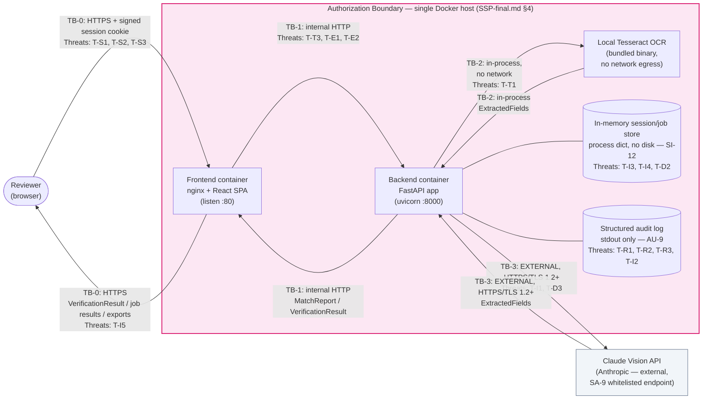

# Threat Model — Alcohol Label Verification PoC

| | |
|---|---|
| **System Name** | Alcohol Label Verification App (ALVA) — TTB COLA Automation PoC |
| **Document Status** | **FINAL** — Phase 4 (ISSUE 4.6, Threat Model Documentation) |
| **Version** | 1.0 |
| **Date** | 2026-06-12 |
| **Issue** | [ISSUE 4.6 — Threat Model Documentation](../../project-management/PROJECT-PLAN.md) ([GitHub #48](https://github.com/hfenelsoftllc/alcohol-label-verification-app/issues/48)) |
| **FedRAMP Controls** | **RA-3** (Risk Assessment), **RA-5** (Vulnerability Monitoring and Scanning) |
| **Related Documents** | [`SSP-final.md`](./SSP-final.md), [`DATA-FLOW-final.md`](./DATA-FLOW-final.md), [`POAM.md`](./POAM.md), [`SAST-RESULTS.md`](./SAST-RESULTS.md), [`ADR-001-System-Architecture.md`](../architecture/ADR-001-System-Architecture.md) |

> **Scope note.** This document satisfies **RA-3 (Risk Assessment)**, the sole open item
> tracked in [`POAM.md`](./POAM.md) §1. It applies the **STRIDE** threat-modeling
> methodology to the trust boundaries (TB-0..TB-3) and data flows enumerated in
> [`DATA-FLOW-final.md`](./DATA-FLOW-final.md) §3–§5, and to the architecture decisions
> recorded in [`ADR-001-System-Architecture.md`](../architecture/ADR-001-System-Architecture.md).
> It does not introduce new code (apart from one small operational-guidance comment in
> `.env.example`, called out in §4.1); it assesses the system **as implemented through
> Phase 4** (issues 1.1–4.5) and identifies the residual risk remaining after the controls
> already documented in `SSP-final.md` §8.

---

## 1. Purpose and Scope

This threat model identifies, categorizes, and rates the security threats applicable to
ALVA's request surface (`/health`, `/verify`, `/verify/batch`, `/jobs/{job_id}/*`), using
**STRIDE** (Spoofing, Tampering, Repudiation, Information Disclosure, Denial of Service,
Elevation of Privilege) as the enumeration framework, as required by the FedRAMP Moderate
baseline's RA-3 control.

For each threat this document records:

- A unique ID (`T-<category letter><n>`)
- **Likelihood** (L/M/H) of the threat being realized under normal operation
- **Impact** (L/M/H) if realized, consistent with the FIPS 199 **Moderate** categorization
  (C=M, I=M, A=M) established in `SSP-final.md` §2
- The **mitigating control** already implemented, with evidence (file/test/control ID)
- **Residual risk** (L/M/H) remaining after that control

It closes the gap identified in `POAM.md` §1 (RA-3), changing that control's status from
**Planned** to **Implemented** in `SSP-final.md` §8.

---

## 2. Methodology

### 2.1 STRIDE category mapping

Per ISSUE 4.6 AC2, each of the six STRIDE categories is mapped to the ALVA concern most
relevant to it:

| STRIDE Category | ALVA Concern | §ref |
|---|---|---|
| **S**poofing | Reviewer session (TB-0 session cookie) | §3.1 |
| **T**ampering | Label image (upload, OCR input, in-transit) | §3.2 |
| **R**epudiation | Audit logs (non-repudiation of requests/events) | §3.3 |
| **I**nformation Disclosure | OCR data (extracted fields, PII, external API) | §3.4 |
| **D**enial of Service | Batch load (image size, concurrency, upstream latency) | §3.5 |
| **E**levation of Privilege | API authorization/authentication | §3.6 |

### 2.2 Likelihood and impact scale

| Rating | Likelihood means... | Impact means... |
|---|---|---|
| **Low (L)** | Requires an operator misconfiguration, host-level compromise, or an attacker capability outside ALVA's threat surface (e.g., compromising the TTB network perimeter) | Effect is confined to a single session/request and does not expose Sensitive data or affect other reviewers |
| **Medium (M)** | Exploitable by a network-adjacent attacker or an authenticated reviewer via crafted input, without needing elevated access | Exposes Internal-classified data, degrades availability for a subset of users/jobs, or requires manual remediation |
| **High (H)** | Occurs by default in normal operation, or requires no special access at all | Exposes Sensitive/PII data, compromises the integrity of verification results, or causes a system-wide denial of service |

**Residual risk** is the rating remaining *after* the mitigating control is applied, using
the same L/M/H scale, and is the figure carried into §5 and `POAM.md`.

---

## 3. Trust-Boundary Diagram, Annotated with Threats

The diagram below extends the **Trust Boundary Diagram** in
[`DATA-FLOW-final.md`](./DATA-FLOW-final.md) §5 (itself derived from the System
Architecture Diagram in [`ADR-001`](../architecture/ADR-001-System-Architecture.md) §
"System Architecture Diagram") by annotating each boundary crossing and the in-memory
store with the threat IDs from §4 that apply to it.

Threats **T-D4** (abandoned SSE connections) and **T-E3/T-E4** (single-role model;
dependency vulnerabilities) are cross-cutting and apply to the `BE` node and its runtime
as a whole rather than to a single labeled edge; they are enumerated in §4.5/§4.6.

---

## 4. Threat Enumeration

### 4.1 Spoofing — Reviewer Session (TB-0)

| ID | Threat | Likelihood | Impact | Mitigating Control | Residual Risk |
|---|---|---|---|---|---|
| **T-S1** | Attacker forges or replays a session cookie to impersonate an authenticated reviewer and access that reviewer's batch jobs/results. | L | M | **IA-2/AC-3/SC-23**: session cookie is `HttpOnly`, `Secure`, `SameSite=Strict`, and HMAC-SHA256-signed by `backend/app/session.py`; verified on every request before any other processing (`SESSION-MANAGEMENT.md`). | **Low** |
| **T-S2** | Operator sets a weak, predictable, or shared `SESSION_SECRET_KEY` across environments (or a CI/staging key leaks into production), enabling session-cookie forgery. | L | H | `_SECRET_KEY` (`backend/app/session.py:42`) defaults to a cryptographically strong `secrets.token_hex(32)` generated per-process if `SESSION_SECRET_KEY` is unset — secure by default. Operator guidance added to `.env.example` (this PR, §5 item 3) explicitly requiring a strong, unique, randomly-generated value per environment if set. | **Moderate** *(Top 3 — see §5)* |
| **T-S3** | Reviewer identity itself is not independently verified by ALVA — anyone who can reach TB-0 and obtain a session cookie is treated as an authorized reviewer. | M | M | TB-0 is an **inherited control** (`SSP-final.md` §1/§7): ALVA is a Minor Application behind the TTB network perimeter (AC-17, GSS-provided ingress/TLS). Identity assurance for "who is on the TTB network" is out of ALVA's boundary. | **Low** *(inherited, PoC scope)* |

### 4.2 Tampering — Label Image (Upload, OCR Input, In-Transit)

| ID | Threat | Likelihood | Impact | Mitigating Control | Residual Risk |
|---|---|---|---|---|---|
| **T-T1** | A crafted/malformed image (corrupt header, decompression bomb, polyglot file) is uploaded as a label image, attempting to crash or exploit the OCR/preprocessing pipeline. | M | M | **SI-10/SI-16**: `validate_image_bytes()` performs magic-byte and `MAX_IMAGE_MB` checks before decoding (`backend/app/validation.py`, HTTP 413/415); `backend/ocr/preprocessor.py::maybe_preprocess` (ISSUE 4.1) never raises and degrades to the original bytes on any failure; unreadable images return `overall_status: "ERROR"` with a plain-language message instead of crashing (SI-17, ISSUE 4.4). | **Low** |
| **T-T2** | A vulnerable version of a third-party image-processing library (OpenCV, Pillow, `pytesseract`, Tesseract binary) is exploited via a crafted image to tamper with backend processing or escalate privileges. | L | H | **RA-5**: every PR runs `pip-audit`, `bandit`, and Trivy container scans (ISSUE 2.6, 4.5); `SAST-RESULTS.md` records 0 high-severity/high-confidence findings as of the latest scan. Known CVEs in these libraries are caught and remediated continuously via CI. | **Low** |
| **T-T3** | An on-host attacker tampers with the label image in transit on TB-1 (frontend → backend), which is plain HTTP. | L | M | TB-1 is confined to the Docker Compose bridge network *within* the single-host authorization boundary (**AC-4**, `DATA-FLOW-final.md` §3/§6) — not reachable without host compromise, which is outside ALVA's application-level threat surface. | **Low** |

### 4.3 Repudiation — Audit Logs

| ID | Threat | Likelihood | Impact | Mitigating Control | Residual Risk |
|---|---|---|---|---|---|
| **T-R1** | A reviewer denies having submitted, viewed, or exported a particular verification result. | L | M | **AU-2/AU-3**: every request to `/health`, `/verify`, `/verify/batch`, and `/jobs/*` emits structured `request_received`/`request_completed` audit events with `request_id`, `session_id`, `endpoint`, `status_code`, and `duration_ms` (`backend/app/audit.py`, `DATA-FLOW-final.md` §4.3). | **Low** |
| **T-R2** | Audit log entries are altered or deleted, undermining non-repudiation, since logs are written to stdout only with no separate immutable store in the PoC. | L | M | **AU-9**: structured JSON logs are collected by the container log driver (inherited control, `SSP-final.md` §8). Altering them requires host/container compromise, which is outside ALVA's application-level threat surface for this PoC. Forwarding container logs to a centralized, write-once log aggregator is a standard operational requirement for any production deployment and should be confirmed during pilot hand-off. | **Low** *(PoC scope; operational follow-up at pilot)* |
| **T-R3** | A request or system event (e.g., a session/job expiry) occurs without leaving an audit trail, preventing reconstruction of what happened. | L | L | Every TTL-based expiry emits a `session_expired` event from both `backend/batch/store.py::_reap_expired` (batch jobs, SI-12) and `backend/app/session.py::_reap_expired` (browser sessions, SC-23) — `DATA-FLOW-final.md` §4.3. | **Low** |

### 4.4 Information Disclosure — OCR Data

| ID | Threat | Likelihood | Impact | Mitigating Control | Residual Risk |
|---|---|---|---|---|---|
| **T-I1** | Sensitive label data and PII (`name_address`, image bytes) are transmitted to the external Claude Vision API (TB-3), a third party outside the authorization boundary. | H | M | **SC-8/SA-9**: TB-3 is HTTPS/TLS 1.2+ via the official `anthropic` SDK (`anthropic==0.109.1`, `max_retries=0`) to a single whitelisted endpoint (`backend/ocr/adapter.py::_extract_with_claude`). `OCR_MODE=local` is available as a complete mitigation (air-gapped operation, TB-3 never used). | **Moderate** *(Top 3 — see §5)* |
| **T-I2** | Sensitive data (image bytes, extracted PII) is inadvertently written to audit logs, which are otherwise Operational-classified and lower-sensitivity. | L | H | **AU-3**: `backend/tests/test_audit_logging.py::test_logs_never_contain_pii` asserts logged events contain only `request_id`, `session_id`, `ocr_engine_used`, `confidence_score`, and `overall_status` — never image bytes, base64, or `name_address`. | **Low** |
| **T-I3** | One reviewer's session reads another session's batch job results (cross-session data leakage) via the in-memory job store. | L | H | **AC-3** (ISSUE 3.7): `store.get_job(job_id)` is scoped to the requesting `session_id`; any other session receives HTTP 404 (`DATA-FLOW-final.md` §4.2 step 10). | **Low** |
| **T-I4** | Sensitive data (label images, extracted fields) is retained in the in-memory job store longer than operationally necessary, increasing the exposure window if the host is compromised. | L | M | **SI-12** (ISSUE 3.5): `store._reap_expired()` drops jobs idle longer than `SESSION_TTL_HOURS` (default 4h); no disk or database persistence at any point (**SC-28**, `DATA-FLOW-final.md` §7). | **Low** |
| **T-I5** | A batch export (CSV/XLSX) contains a formula-injection payload (e.g., `=HYPERLINK(...)`) that exfiltrates data or executes when opened in spreadsheet software. | M | M | **CWE-1236 mitigation** (PR #66, "Sanitize CSV/XLSX export cells against formula injection"): every export cell is sanitized before being written to the in-memory CSV/XLSX stream (`DATA-FLOW-final.md` §4.2 step 9). | **Low** |

### 4.5 Denial of Service — Batch Load

| ID | Threat | Likelihood | Impact | Mitigating Control | Residual Risk |
|---|---|---|---|---|---|
| **T-D1** | A single oversized image or batch upload exhausts backend memory/CPU before any processing begins. | M | M | **SI-10**: `MAX_IMAGE_MB=20` (per image) and `MAX_BATCH_MB=500` (per batch) are enforced by `backend/app/validation.py` before decoding, returning HTTP 413. | **Low** |
| **T-D2** | Many sessions submit large batch jobs concurrently; `BATCH_MAX_WORKERS` (`asyncio.Semaphore`, default 10, `backend/batch/orchestrator.py`) bounds concurrency **within** a single job, but there is no global cap on the number of concurrent batch jobs **across** sessions, allowing aggregate resource exhaustion. | M | M | Partial: per-job concurrency is bounded (above). No control currently limits cross-session concurrent job count. | **Moderate** *(Top 3 — see §5)* |
| **T-D3** | Slow or hanging calls to the external Claude Vision API (TB-3) block worker capacity, degrading throughput for all reviewers. | L | M | **SI-10/ADR-001**: `OCR_API_TIMEOUT_SECONDS` (default 30s) with `max_retries=0`; on `APITimeoutError`/`APIConnectionError`/`RateLimitError`/`TimeoutError`/`ConnectionError`, `extract_fields()` fails over immediately to local Tesseract (TB-2), so a slow/unreachable TB-3 degrades quality (lower confidence) rather than blocking. | **Low** |
| **T-D4** | A client opens an SSE stream (`GET /jobs/{job_id}/stream`) and abandons it without closing, holding server-side resources open indefinitely. | L | L | Session/job TTL reaping (**SI-12**) bounds the lifetime of the underlying job regardless of stream state; the browser's native `EventSource` (ISSUE 4.4 AC6) reconnects on transient drops rather than holding a broken connection open, and polling fallback (`/jobs/{job_id}/status`) does not depend on the stream remaining open. | **Low** |

### 4.6 Elevation of Privilege — API Authorization

| ID | Threat | Likelihood | Impact | Mitigating Control | Residual Risk |
|---|---|---|---|---|---|
| **T-E1** | An unauthenticated client calls `/verify`, `/verify/batch`, or `/jobs/*` directly, bypassing the reviewer session. | L | H | **IA-2/AC-3** (ISSUE 3.7): session middleware (`backend/app/session.py`) validates the signed session cookie before any route handler executes; requests without a valid cookie are rejected. | **Low** |
| **T-E2** | Crafted input (malformed `ApplicationData` fields, unexpected CSV columns/types) is used to escalate behavior beyond the intended verification flow (e.g., injection into downstream processing). | M | M | **SI-10/SI-16** (ISSUE 3.8): request bodies are validated against Pydantic schemas; `backend/batch/csv_input.py` rejects CSVs with unknown or missing columns (HTTP 422) before any row is processed. | **Low** |
| **T-E3** | ALVA has a single reviewer role with no RBAC — any authenticated session has identical privileges, so a compromised session has full application access (though not cross-session, per T-I3). | L | M | Scope-bounded by design: `ADR-001` and `SSP-final.md` §1 define ALVA as a single-role Minor Application for the PoC; RBAC is out of scope. Accepted risk, documented here for transparency. | **Low** *(accepted, scope-bounded)* |
| **T-E4** | A vulnerability in a backend dependency or the container runtime is exploited to execute code with elevated privileges inside the `alvf-backend` container. | L | H | **CM-7**: containers run as non-root users (`docker/backend.Dockerfile`, `docker/frontend.Dockerfile`). **RA-5**: Trivy/`bandit`/`pip-audit` CI scanning catches known CVEs continuously (`SAST-RESULTS.md`, 0 high findings). | **Low** |

---

## 5. Top 3 Risks

Per ISSUE 4.6 AC4, the three threats above with the highest residual risk are called out
here with an owner and mitigation timeline. All three are rated **Moderate** residual —
no **High** residual risks remain after the controls in §4.

| Rank | Threat | Residual Risk | Owner | Mitigation Plan | Timeline |
|---|---|---|---|---|---|
| 1 | **T-I1** — Sensitive label data and PII sent to the external Claude Vision API (TB-3) | Moderate | Development team + TTB ISSO (joint) | Confirm the Anthropic commercial API's data-handling/retention terms meet FedRAMP Moderate requirements as part of the ATO authorization package (`SSP-final.md` §6/§7). No code change required: `OCR_MODE=local` is already available and fully eliminates TB-3 if the DPA terms are insufficient for a given deployment. | Prior to ATO submission, and before any pilot deployment processes real applicant PII with `OCR_MODE=auto`. |
| 2 | **T-D2** — No global cap on concurrent batch jobs across sessions | Moderate | Development team | Add a global concurrency limit (e.g., a process-wide `asyncio.Semaphore` or per-deployment max-concurrent-jobs setting) in `backend/batch/orchestrator.py`/`store.py`, sized to pilot host capacity. Track as a new POA&M item opened by this document (see §6). | Before pilot/production deployment (post-PoC; candidate for Phase 5). |
| 3 | **T-S2** — `SESSION_SECRET_KEY` operational misconfiguration could enable session-cookie forgery | Moderate | Development team (docs, this PR) + TTB operations (deployment config) | `.env.example` updated (this PR) with explicit guidance to set a strong, unique, randomly-generated `SESSION_SECRET_KEY` per environment (e.g. `openssl rand -hex 32`) and never reuse it across environments. Deployment runbook/hand-off documentation to reiterate this requirement. | Documentation: this PR (immediate). Operational enforcement: at pilot deployment configuration time. |

---

## 6. Residual Risk Summary and POA&M Disposition

- **18 threats enumerated** across all 6 STRIDE categories (3 Spoofing, 3 Tampering, 3
  Repudiation, 5 Information Disclosure, 4 Denial of Service, 4 Elevation of Privilege).
- **15 of 18** carry **Low** residual risk after existing controls — no further action
  required.
- **3 of 18** (T-S2, T-I1, T-D2) carry **Moderate** residual risk and form the Top 3 in §5.
  None carry **High** residual risk.
- **RA-3 disposition**: completion of this document satisfies `POAM.md` §1's RA-3
  remediation. RA-3 moves from **Planned** to **Implemented** in `SSP-final.md` §8 (see
  companion updates to `POAM.md`, `SSP-final.md`, `README.md`, and `CONTROL-MATRIX.xlsx` in
  this PR).
- **New POA&M item**: T-D2 (global batch-concurrency cap) is recommended as a new,
  low-priority POA&M item for the pilot/production phase — it is **not** a gap in any
  currently-assessed control (no FedRAMP control currently requires a cross-session
  concurrency cap for a single-host PoC), but is flagged here as a forward-looking
  scalability action per `POAM.md`'s closing note ("This POA&M will be updated if
  `THREAT-MODEL.md` ... surfaces additional findings").

---

## 7. Review Sign-off

| Reviewer | Role | Decision | Date |
|---|---|---|---|
| hfenelsoftllc | Project Lead | **Approved** — STRIDE coverage, residual risk ratings, and the Top 3 risks (§5) with their owners and mitigation timelines are accepted as written. | 2026-06-12 |

> Per ISSUE 4.6 AC6, this sign-off authorizes closing **RA-3** in `POAM.md` and
> `SSP-final.md` §8 (Planned → Implemented), and accepts **T-D2** as a new, low-priority
> POA&M item for the pilot/production phase (§6).

---

## 8. References

- [`DATA-FLOW-final.md`](./DATA-FLOW-final.md) — trust boundaries (TB-0..TB-3), data
  classification levels, and the base trust-boundary diagram (§5) annotated in §3 above.
- [`SSP-final.md`](./SSP-final.md) — system description (§1–§4), data type inventory and
  PII declaration (§5–§6), control implementation status (§8).
- [`POAM.md`](./POAM.md) — RA-3 open item (§1) closed by this document.
- [`SAST-RESULTS.md`](./SAST-RESULTS.md) — RA-5 evidence (SCA/SAST scan results referenced
  in T-T2, T-E4).
- [`ADR-001-System-Architecture.md`](../architecture/ADR-001-System-Architecture.md) —
  system architecture and data flow diagrams underlying §3.
- [`SESSION-MANAGEMENT.md`](./SESSION-MANAGEMENT.md) — session cookie implementation
  details underlying T-S1/T-S2/T-S3.
